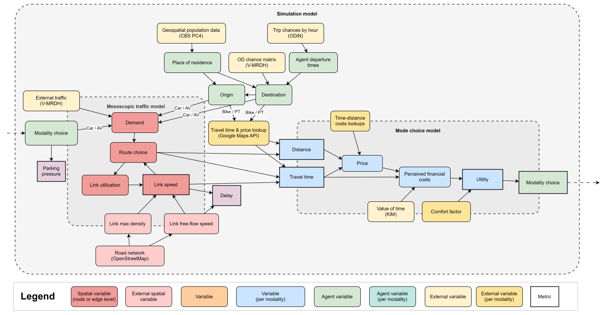
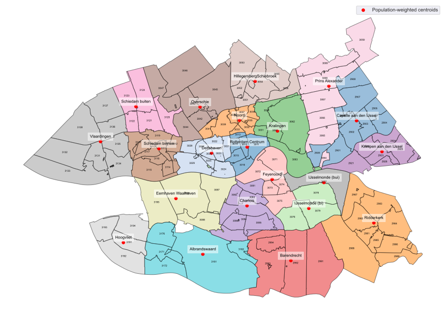
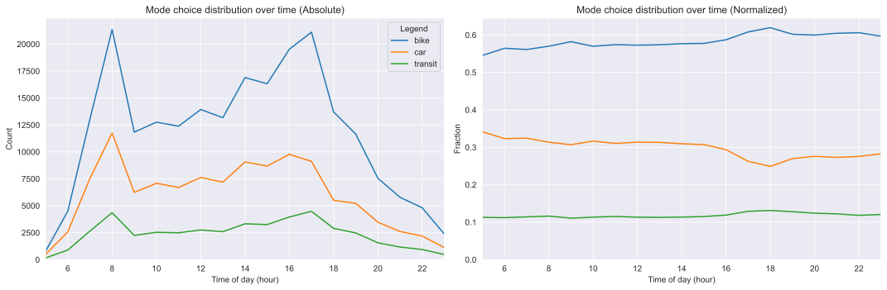
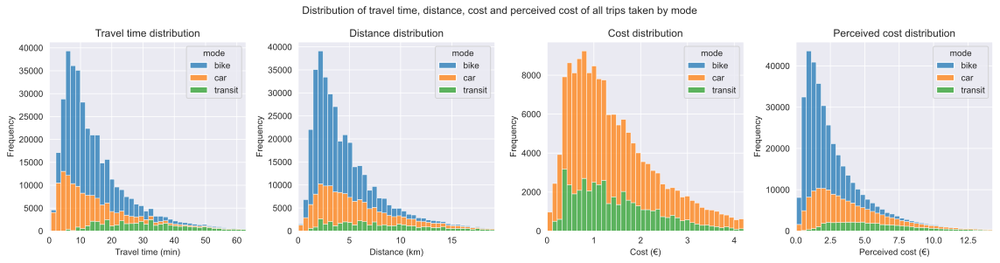
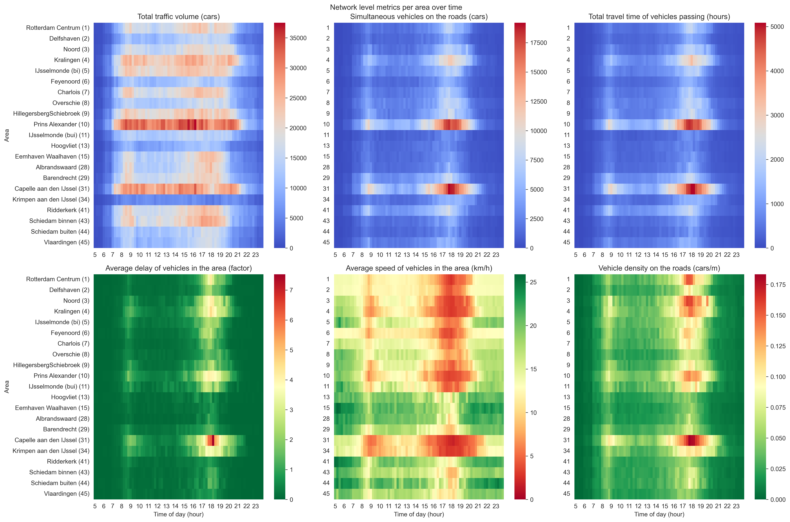
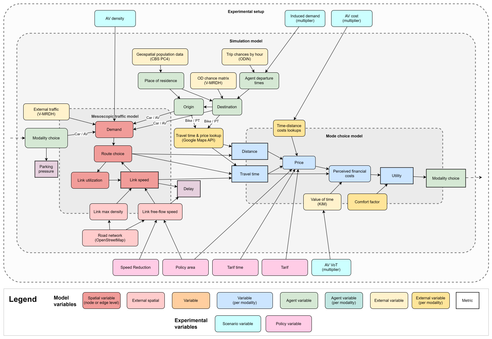

<h1>When do autonomous vehicles solve or exacerbate urban mobility problems?</h1>
<h3>A simulation study of modal shifts and system-level impacts</h3>

# Abstract
**Background:** Autonomous vehicles (AVs) could fundamentally transform urban transportation, but their system-level effects remain poorly understood. Most simulation studies omit competition with sustainable transport modes, assume fixed operational efficiency, and optimize policies for single scenarios, leaving critical interactions between AV characteristics and system performance unexplored.

**Goal:** This study investigates how the interaction between AV cost, perceived travel time value, space efficiency, and induced demand produces different urban mobility outcomes, and tests whether commonly recommended policies remain effective across these futures.

**Methods:** An integrated agent-based and mesoscopic traffic simulation framework was developed for Rotterdam, Netherlands, combining heterogeneous mode choice decisions with dynamic network feedback. A full-factorial analysis explored 144 scenarios varying AV cost, perceived time value, space efficiency, and induced demand, and nine policy combinations were tested across eight representative futures.

**Results:** Space efficiency emerges as a threshold variable: below a density factor of approximately 0.5 relative to conventional vehicles, high AV adoption maintains system performance; above it, adoption degrades the network regardless of cost or comfort. AVs compete more directly with cycling and transit than with private cars, with sustainable mode users switching earlier and faster. No tested policy – including congestion pricing, speed reductions, and spatial restrictions – proved effective across all scenarios; interventions beneficial with inefficient AVs often proved counterproductive with efficient ones.

**Conclusions:** AV impacts on urban mobility appear to depend fundamentally on space efficiency rather than cost alone. Static policy interventions may be insufficient for managing a transition whose outcomes remain highly uncertain, suggesting the need for adaptive frameworks robust to multiple futures.

Keywords: autonomous vehicles, urban mobility, agent-based modeling, traffic simulation, mode choice, transportation policy, modal shift, induced demand

# 1. Introduction
Autonomous vehicles could fundamentally alter urban transportation systems, yet predicting their system-level impacts remains a major modeling challenge. Unlike incremental improvements to existing modes, AVs simultaneously affect mode choice, network capacity, and travel demand through interconnected feedback loops. A growing body of simulation research has explored these impacts, but as a recent synthesis of 170 AV simulation studies reveals, critical gaps persist: most studies include only AV modes without modeling competition with conventional vehicles or public transit, few systematically explore parameter uncertainty, and policy recommendations remain fragmented and sometimes contradictory (Hardaway & Cai, 2026). The dominant finding across this literature – that AVs are likely to increase vehicle kilometers traveled unless actively managed – masks substantial variation in outcomes depending on modeling assumptions, particularly regarding operational efficiency and induced demand.

## 1.1 Challenges in modeling system-level AV impacts
Three interrelated technical challenges have limited previous attempts to capture AV impacts at the system level, spanning both behavioral representation and network modeling.

The first concerns modal competition. Most AV simulation studies focus on AV-only or AV-with-car scenarios (Hardaway & Cai, 2026), yet empirical evidence from ride-hailing services suggests that new mobility technologies may primarily attract users away from public transit rather than reducing private car use (Graehler et al., 2019). Hörl et al. (2021) demonstrated this dynamic through an agent-based simulation of a cost-covering autonomous taxi service in Zurich: despite clear benefits to individual users, the service produced largely negative system impacts, with driven distance increasing by up to 100% due to modal shifts from sustainable modes. Whether AVs would similarly draw from cycling, a dominant mode in many European cities, has received limited attention, partly because few studies have been conducted in contexts with high cycling mode shares. Modeling this competition requires a framework that endogenously represents mode choice across all major urban transport options, including non-motorized modes, while capturing how individual decisions aggregate into system-level effects.

The second challenge involves the representation of operational efficiency in traffic simulation. AV studies typically assume either that AVs operate as standard vehicles or that they achieve idealized efficiency through platooning or sharing, without systematically exploring intermediate cases or identifying critical performance thresholds. Yet the space each AV consumes per passenger transported, determined by vehicle size, occupancy, following distances, and empty repositioning, fundamentally shapes network-level outcomes. Liu et al. (2022) showed that shared AV fleet efficiency significantly influences vehicle miles traveled and parking demand, Yan et al. (2020) demonstrated that fleet performance varies substantially with trip density and operational constraints, and Tang et al. (2024) found that AVs generated an average of 8.8 km of additional zero-occupant travel per trip in a Hangzhou simulation. Dai et al. (2024) estimated total VKT increases of 10–25% across three Chinese cities under full AV adoption. These findings suggest that operational efficiency may matter more than commonly assumed, but the literature lacks a systematic framework for understanding how different efficiency levels produce qualitatively different system dynamics rather than merely shifting outcomes along a continuum.

The third challenge is capturing the feedback between adoption patterns and network performance within a single modeling framework. Agent-based models can represent heterogeneous decision-making but traditionally struggle with network-scale traffic dynamics, while traffic simulation models excel at network analysis but typically use simplified behavioral assumptions. Recent work has advanced integration of these approaches – Narayanan et al. (2022) combined dynamic user equilibrium with operational models for shared AV services, Fakhrmoosavi et al. (2022) proposed a stochastic framework for assessing network-level impacts of connected vehicles, and Wang et al. (2024) developed multimodal traffic assignment models considering heterogeneous demand. However, these studies have generally relied on static assignment methods or predetermined adoption scenarios rather than capturing how adoption patterns and network conditions co-evolve temporally. Li et al. (2025) developed an activity-based and agent-based co-simulation framework for the Rotterdam–The Hague metropolitan region that integrates ActivitySim with MATSim, demonstrating the potential for detailed behavioral modeling at regional scale, though their initial application focused on establishing the baseline framework rather than exploring technology scenarios.

## 1.2 Research gaps
These challenges interact in ways that existing approaches do not adequately capture. Hardaway & Cai (2026) found that whether a simulation includes induced demand fundamentally determines its policy conclusions: studies that model feedback loops consistently find AVs increase congestion and recommend restrictive policies, while those that omit such dynamics tend to predict efficiency gains. Similarly, studies simulating only peak hours tend to miss demand accumulation effects that emerge over a full day. Yet no study has systematically explored how the interaction between operational efficiency, cost, perceived travel time value, and induced demand creates different adoption trajectories and system outcomes, or tested whether commonly recommended policies like congestion pricing (the most frequently suggested intervention across the literature) remain effective across these different futures.

This gap is both substantive and methodological. On the substantive side, it remains unclear whether AV operating characteristics create gradual performance changes or sharp threshold effects, and how modal competition with sustainable modes varies across different adoption trajectories. On the methodological side, addressing these questions requires an integrated framework that combines behaviorally-rich individual decision-making with dynamic network simulation at sufficient scale for city-wide analysis, while remaining computationally tractable enough to explore a large scenario space.

## 1.3 Research contribution
This paper addresses these gaps through an integrated simulation framework combining agent-based modeling with mesoscopic traffic simulation, applied to Rotterdam, Netherlands. Building on Fakhrmoosavi et al.'s (2022) approach to handling parameter uncertainty, we systematically explore 144 scenarios through full-factorial variation of AV cost, perceived time value, space efficiency, and induced demand. Our framework extends Narayanan et al.'s (2022) integration of transport modeling approaches while adding explicit representation of operational efficiency thresholds identified as important by Yan et al. (2020) and Liu et al. (2022).

The study makes both methodological and substantive contributions. Methodologically, the framework integrates individual mode choice decisions with mesoscopic traffic simulation through a discrete event system, enabling analysis of temporal feedback between adoption and network performance at urban scale. Substantively, the framework is applied to address four research objectives:

1. Identify critical thresholds in AV operating characteristics, particularly space efficiency, that create qualitatively different system behaviors, by treating density as a continuous, outcome-based variable agnostic to specific technological implementations.
2. Quantify how different AV characteristics influence competition with all major urban transport modes, including cycling, within a city where sustainable modes hold dominant market shares – addressing the gap identified across most AV simulation studies, which omit non-motorized modes entirely.
3. Evaluate the robustness of commonly recommended policy interventions – congestion pricing, speed reductions, spatial restrictions – across multiple possible futures rather than optimizing for a single scenario.
4. Assess whether the interaction between AV characteristics and policy creates scenario-dependent effectiveness, where interventions beneficial in one future prove counterproductive in another.

Rotterdam provides a particularly informative case study for these questions. Its combination of high cycling mode share, extensive public transit, and significant car usage creates a multimodal context where AV competition with sustainable modes can be directly observed, a dynamic that studies in car-dependent cities, which dominate the current literature (Hardaway & Cai, 2026), cannot capture. Additionally, the city's size (approximately one million inhabitants) makes it large enough to exhibit complex mobility patterns while remaining computationally manageable for systematic scenario analysis.

## 1.4 Paper organization
The remainder of this paper is organized as follows. Section 2 describes the modeling framework, study area, data sources, validation, and experimental design. Section 3 presents results examining adoption patterns, network effects, and intervention effectiveness. Section 4 discusses implications for transportation system modeling and planning, while Section 5 concludes with key insights and future research directions.

# 2. Methods
This study employs an integrated simulation framework combining agent-based modeling (ABM) for individual travel decisions with mesoscopic traffic simulation for network dynamics, applied to the Rotterdam metropolitan area. The framework enables analysis of feedback loops between AV adoption patterns and transportation system performance at urban scale, while remaining computationally tractable for systematic exploration of 144 scenarios and 72 scenario-policy combinations. The model was developed following the Modeling & Simulation lifecycle (Law, 2014) and structured according to the ODD protocol (Grimm et al., 2020).

## 2.1 Modeling framework
The modeling approach consists of three interconnected layers. The first layer contains dynamic processes: the daily movements of travelers choosing transport modes and navigating through traffic, with continuous feedback between individual decisions and network conditions. The second layer includes experimental variables representing key uncertainties about AVs (cost, perceived time value, space efficiency, and induced demand) and potential policy interventions. These variables remain constant during each simulation but are systematically varied between simulations to explore different futures. The third layer provides validated baseline data – population distribution, road networks, and travel patterns – which remains constant across all scenarios to ensure meaningful comparisons.

The model builds upon the traditional four-step transportation demand model (McNally, 2007) but implements it within an agent-based, discrete-event framework using Mesa 3 (Ter Hoeven et al., 2025). The first two steps – trip generation and trip distribution – are derived from empirical data to ground the model in validated travel patterns. Trip generation rates come from the Dutch National Travel Survey (ODiN 2023), while trip distribution uses origin-destination matrices from the V-MRDH transport model. The latter two steps – mode choice and route assignment – are modeled dynamically through agent behavior and traffic simulation, enabling investigation of how travelers might respond to new mobility options.

_Fig. 2.1: Conceptual model displaying submodels, variables, and their interactions. Population data and trip patterns determine where and when agents travel; the road network provides infrastructure for traffic simulation. When agents choose car or AV modes, their trips feed into the mesoscopic simulation, which calculates congestion and travel times that feed back into subsequent mode choices. Non-motorized and transit travel times remain fixed._

The process creates two feedback loops: a direct loop where traffic conditions influence immediate mode choices through updated travel times, and an indirect loop where accumulated trips affect network performance over time. This generates emergent phenomena including congestion-based stabilization (negative feedback as congestion discourages further motorized travel), mode choice reinforcement through trip chaining (agents who choose car for an outbound trip must use it for the return), and tipping point behavior where interactions between heterogeneous value of time, density-dependent congestion, and mode-specific comfort factors create sharp transitions between system states.

## 2.2 Study area and data
Rotterdam, Netherlands was selected as representative of medium-sized European cities with diverse transport options and current mobility challenges. The study area encompasses approximately one million residents across 125 four-digit postal code (PC4) areas nested within 21 traffic analysis zones from the V-MRDH transport model. Rotterdam's combination of high cycling mode share, extensive public transit, and significant car usage creates a multimodal context where AV competition with sustainable modes can be directly observed. Its size makes it large enough to exhibit complex mobility patterns while remaining computationally manageable for systematic scenario analysis.

_Fig. 2.2: Study area divided into 21 MRDH regions and 125 postal code areas._

### Spatial and temporal structure
The 125 PC4 areas create 15,500 possible origin-destination pairs, ensuring highly heterogeneous travel options. The road network, derived from OpenStreetMap (September 2024), comprises 1,575 nodes and 3,328 edges. The inner-city network includes all roads from tertiary level upward, while a simplified surrounding network includes major roads only, balancing detail with computational efficiency. Planned infrastructure improvements (A16 motorway, Blankenburg tunnel) were included to represent near-future conditions.

_Fig. 2.3: Road network used in the traffic simulation, showing hierarchical road types._

Simulations run from 05:00 to 24:00 with 5-minute system time steps. The model uses discrete event simulation to activate agents with high temporal precision: individual agents initiate trips at any point in continuous time based on ODiN-derived hourly probabilities distributed uniformly within each hour. The traffic simulation operates at nested frequencies – vehicle platoons are updated every 10 seconds for position and speed, route choices are recomputed every 150 seconds through Dynamic User Equilibrium, and network metrics are collected at 15-minute intervals. The excluded overnight period accounts for less than 1% of daily trips.

### Data sources
Multiple empirical data sources were integrated to enable realistic simulation. Population distribution and vehicle ownership data from CBS (2023) were used at the PC4 level, with car ownership varying between 19% and 65% across areas (mean 31.5%). Each agent in the simulation represents a platoon of 10 actual travelers for computational efficiency, yielding approximately 100,000 agents for the 991,575 residents.

Origin-destination matrices from the V-MRDH 3.0 transport model (October 2023) provide spatial trip distribution for three time periods: morning peak (7:00–9:00), evening peak (16:00–18:00), and off-peak. These matrices were processed into probability distributions for trip destinations given each origin, aggregated across all transport modes, so that mode choice could be modeled endogenously as an agent decision. External traffic entering and leaving the study area was modeled separately using mode-specific matrices from V-MRDH, scaled by a calibrated load factor of 0.8 to account for imperfections in both the extracted road network and the traffic simulation. This factor was determined through calibration against observed traffic patterns and held constant across all experiments.

Travel times and costs for non-car modes were collected using the Google Maps Distance Matrix API for all 15,500 origin-destination pairs, captured on a typical Thursday morning (September 17, 2024, 08:00). For cars, travel times are calculated dynamically by the traffic simulation. Travel costs were derived from mode-specific sources: variable car costs of €0.268/km (Nibud, 2024), distance-based public transit pricing following the NS tariff structure (€0.169/km base rate with declining rates beyond 40 km), zero marginal cost for bicycles, and AV pricing based on a regression analysis of Waymo's September 2024 rates in Los Angeles (€3.79 base fare + €1.41/km + €0.40/min).

Value of time (VoT) parameters were derived from KiM (2023): €10.42/hour for cars, €10.39/hour for bicycles, and €7.12/hour for public transit. AV values are scaled from the car VoT using an adjustable factor explored in scenarios. Individual heterogeneity was introduced through agent-specific VoT multipliers drawn from a lognormal distribution (μ = −0.1116, σ = 0.4724, capped at 4.0), producing a population mean of 1.0 and standard deviation of 0.5. An agent's final VoT for each mode is the product of the mode's base value and their personal multiplier, creating realistic variation in mode preferences even among agents facing identical travel options.

## 2.3 Agent behavior model
Agents represent individual travelers with heterogeneous characteristics: home location (PC4 area), car ownership, driver's license possession, and personal VoT multiplier. Each agent generates trips based on empirically-derived hourly probabilities from ODiN 2023, with destinations drawn from V-MRDH origin-destination probability matrices that vary by time period. Trips are structured as two-leg chains (outbound and return), with mode availability constrained by previous choices – if an agent departs by car, the return trip must also be by car, as the vehicle must return home.

### Mode choice specification
Agents choose between available modes (conventional car, AV, bicycle, public transit) by minimizing comfort-adjusted perceived cost. The perceived cost $C_{p,m}$ for a trip using mode $m$ is:

$$C_{p,m} = (C_{m,m} + T_m \cdot V_m) \cdot \alpha_m$$

where $C_{m,m}$ is the monetary cost, $T_m$ is the travel time, $V_m$ is the agent's individual value of time for mode $m$, and $\alpha_m$ is a mode-specific comfort factor. The agent selects the mode with the lowest $C_{p,m}$. Comfort factors were set to $\alpha_{\text{car}} = 0.5$, $\alpha_{\text{bike}} = 1.33$, $\alpha_{\text{transit}} = 1.0$, and $\alpha_{\text{AV}} = 1.0$. These values reflect that car travel is generally perceived as more comfortable than alternatives (effective halving of perceived cost), while cycling carries a comfort penalty relative to motorized modes, consistent with revealed preference patterns in Dutch travel behavior. Transit and AVs are treated as neutral baselines.

This deterministic utility-minimization approach was chosen over random utility models (e.g., multinomial logit) for three reasons. First, the lack of stated preference data for AVs in the Rotterdam context made calibrating error terms and scale parameters speculative. Second, the research focus on system-level threshold behavior benefits from a framework where transitions between system states are not smoothed by random error – the deterministic formulation identifies tipping points more sharply, making it more conservative for threshold detection. Third, population-level stochasticity is already introduced through the heterogeneous VoT multipliers drawn from the lognormal distribution: agents with different VoT values make different mode choices for identical trips, producing realistic variation in aggregate mode shares without requiring an explicit error component. The combination of deterministic individual choice with heterogeneous preferences thus serves a similar function to random utility at the population level while providing cleaner identification of threshold behavior at the system level.

A limitation of this approach is that it does not capture habitual behavior, psychological factors, or complex preferences beyond the single comfort factor per mode. This likely produces sharper modal transitions than would occur in practice. However, for the research objective of identifying whether qualitatively different system states exist and under what conditions transitions occur, this sharpness is methodologically advantageous – it reveals thresholds that might be obscured by behavioral noise in more complex choice models.

### Mode availability and trip chaining
All agents are assumed to have bicycle access. Car availability depends on ownership and driver's license possession, assigned probabilistically at initialization based on PC4-level CBS data. When an agent uses a car for an outbound trip, only car is available for the return leg; when using bike, transit, or AV, car is excluded from the return trip options (as the car remains at home). This creates path dependency where initial mode choices constrain subsequent options, amplifying the impact of factors influencing initial choices.

## 2.4 Traffic simulation
The traffic simulation uses UXsim (Seo, 2025), a mesoscopic simulator implementing Newell's simplified car-following model, which represents traffic flow as a kinematic wave. This approach was selected as a middle ground: microscopic simulation would be computationally prohibitive at city scale for 144+ scenarios, while macroscopic models would miss intersection delays and route choice dynamics that affect system performance.

### Vehicle dynamics
When agents choose car or AV, they are added to the traffic simulation as vehicles grouped into platoons of 10. Each platoon's position on a link evolves as:

$$X(t + \Delta t, n) = \min\{X(t, n) + u\Delta t, \; X(t + \Delta t - \tau \Delta n, n - \Delta n) - \delta\Delta n\}$$

where $X(t,n)$ is the position of platoon $n$ at time $t$, $u$ is the link's free-flow speed, and $\delta$ is the jam spacing. Vehicles travel at free-flow speed when unconstrained and maintain safe following distances in congestion. Road characteristics are differentiated by type: motorways use jam densities of 0.14 vehicles/m/lane, scaling up to 0.20 for residential and tertiary roads.

Traffic at intersections is resolved by the incremental node model (Tampère et al., 2011), which processes vehicles sequentially based on merge priorities. Due to the absence of explicit intersection data in OpenStreetMap, default equal priorities were assigned to all incoming lanes – a simplification that may underestimate local bottleneck effects but is adequate for system-level analysis.

### Route choice
Route choice employs a Dynamic User Equilibrium (DUO) model. The attractiveness $B^{z,i}_o$ of link $o$ for vehicles with destination $z$ at time step $i$ is updated as:

$$B^{z,i}_o = (1 - \lambda)B^{z,i-\Delta i_B}_o + \lambda b^{z,i}_o$$

where $\lambda = 0.5$ is a weight parameter, $b^{z,i}_o$ indicates whether link $o$ is on the current shortest path to $z$, and routes are recomputed every 150 seconds (with noise parameter 0.01 to prevent identical route choices). This formulation allows vehicles to gradually adapt routes based on evolving conditions rather than responding instantaneously.

### AV density implementation
AV space efficiency is parameterized through a density factor representing the road space consumed per person transported, relative to conventional vehicles. Rather than modifying vehicle physics, density is implemented probabilistically at trip generation: for a density factor $d < 1.0$, each AV trip is added to the traffic simulation with probability $d$ (the remaining trips still occur but without network impact, representing higher occupancy or smaller vehicles that consume proportionally less capacity). For $d > 1.0$, each trip generates an additional vehicle with probability $d - 1$ (representing empty repositioning trips or increased safety margins). In all cases, the agent completes their journey – the mechanism affects only the network load per AV trip.

This implementation treats density as an outcome-based metric agnostic to specific technological implementations. A density factor of 0.5 could represent doubled average occupancy, halved following distances through platooning, smaller urban-optimized vehicles, or combinations thereof. By abstracting from implementation specifics, results remain relevant regardless of which efficiency mechanisms ultimately emerge.

### Feedback between components
The agent-based and traffic simulation components are synchronized at 5-minute intervals. When agents choose car or AV, their trips are injected into UXsim, which simulates traffic flow and updates network travel times. These updated times are then available to subsequent agents making mode choices, creating the feedback loop between individual decisions and system performance. For bicycle and transit, travel times remain fixed based on Google Maps data, as these modes are assumed to be largely unaffected by road traffic congestion.

Car trips include an additional 36 seconds of travel time representing parking search and walking time. Upon trip completion, vehicle arrival triggers a callback event that schedules the agent's journey completion in the discrete event system, ensuring precise temporal coordination between the two simulation components.

## 2.5 Model validation
The model was validated against ODiN 2023 data for the Rotterdam area and assessed for plausible network behavior. The objective was not absolute predictive accuracy but sufficient validity to meaningfully examine relative changes across scenarios.

### Mode share validation
In the inner city (Noord, Kralingen, Rotterdam Centrum, Feyenoord, Delfshaven), the model produces mode shares of 11.3% car, 82.3% bicycle, and 6.5% transit, compared to empirical values of 13.4%, 69.9%, and 16.7%. For the broader study area, the model shows 25.4% car, 65.1% bicycle, and 9.5% transit versus empirical values of 37.7%, 49.0%, and 13.3%.

The model systematically overestimates bicycle usage and underestimates car and transit use. This deviation is consistent with the model's omission of car-favoring factors not captured in the cost-time framework: weather conditions, cargo requirements, multi-stop trip chains, and habitual preferences. The comfort factor for cars ($\alpha = 0.5$) partially compensates for these factors but does not fully capture their effect.

For interpreting AV adoption results, this bias has directional implications. The overrepresentation of cyclists means the model contains a larger pool of agents who could potentially switch to AVs from cycling, which may overstate the magnitude of cycling-to-AV shifts. Conversely, the underrepresentation of car users means fewer agents are available for car-to-AV transitions, potentially understating this shift. However, the *relative ordering* – that cyclists switch earlier and faster than car users – is robust to this bias, as it emerges from the structural cost advantages AVs hold over cycling (weather independence, productive travel time, comfort) versus the smaller differential with car travel (similar comfort, offset by AV pricing). The finding that AVs compete more with sustainable modes than cars is therefore likely conservative for the car competition dimension but may overstate the absolute magnitude of cycling displacement.

### Travel pattern and network validation
Temporal patterns show strong alignment with empirical data: the model reproduces the sharp morning peak (8:00–9:00) and broader evening peak (16:00–18:00) observed in ODiN data. Trip distance distributions follow expected log-normal patterns, with bicycles dominating shorter trips (1–5 km) and motorized modes more prevalent at longer distances.

_Fig. 2.4: Mode distribution throughout the day in the default scenario (no AVs)._

_Fig. 2.5: Distributions of travel time, distance, monetary cost, and perceived cost by mode in the default scenario._

The traffic simulation demonstrates plausible behavior at known congestion points. The Algera bridge bottleneck in Krimpen aan den IJssel and the Terbregseplein interchange show appropriate congestion patterns. Network speeds average 25 km/h in the default scenario, decreasing to 10–15 km/h in congested inner-city areas during peak hours. The model captures expected asymmetry between morning and evening peaks: despite similar trip generation rates, the evening peak produces more severe congestion due to more dispersed destination patterns, locked-in mode choices and accumulated delay effects, the latter an emergent property.

_Fig. 2.6: Network performance metrics by geographic area during the day in the default scenario._

### Validation limitations
Several limitations inform result interpretation. Detailed validation of intersection-level dynamics was not possible due to computational constraints and data availability (commercial traffic data providers declined access requests). AV-related behavioral assumptions cannot be directly verified due to the technology's emerging nature. Non-car travel times are based on a single Thursday morning measurement, not capturing time-of-day variation in transit service frequency. Despite these limitations, the model's reproduction of key modal, temporal, and spatial patterns provides sufficient validity for examining relative changes across scenarios, while specific numerical predictions should be interpreted with appropriate caution.

## 2.6 Experimental design
Two complementary experiments were conducted: a scenario analysis exploring AV adoption under uncertainty, and a policy analysis testing interventions across representative futures.

_Fig. 2.7: Conceptual model including scenario uncertainties and policy levers._

### Scenario analysis
A full-factorial design was employed to systematically explore interactions between four key uncertainties, selected through literature review and stakeholder consultation as the factors most likely to produce distinct system-level dynamics:

1. **AV cost factor** (4 levels: 1.0, 0.5, 0.25, 0.125): Cost relative to current Waymo pricing. Logarithmic spacing reflects that cost differences matter more at lower price points where they may trigger adoption thresholds.
2. **AV value of time factor** (3 levels: 1.0, 0.5, 0.25): Perceived value of time in AVs relative to conventional cars. Lower values represent scenarios where productive use of travel time reduces its perceived cost.
3. **AV density factor** (4 levels: 1.5, 1.0, 0.5, 0.333): Space efficiency relative to conventional vehicles. Values above 1.0 indicate less efficient operation (safety margins, empty repositioning); below 1.0 represents improved efficiency (higher occupancy, platooning, smaller vehicles).
4. **Induced demand** (3 levels: 1.0, 1.25, 1.5): Multiplicative increase in trip generation rates, capturing both AV-induced demand and external growth factors. Range based on historical precedent from major transportation improvements.

This design created 144 unique scenarios (4 × 3 × 4 × 3), each simulated for a full day (05:00–24:00). The factorial approach was chosen over Monte Carlo or Latin Hypercube sampling for its interpretability: each scenario represents a clear parameter combination enabling direct comparison, and the logarithmic spacing of cost levels captures non-linear adoption responses.

### Policy analysis
Eight representative scenarios were selected to span the range of futures identified in the scenario analysis, from current conditions to extreme AV progress, including several "race to bottom" scenarios with cheap but variably efficient AVs (Table 2.1). All policy scenarios used a VoT factor of 0.5 to focus on cost and density interactions.

| Scenario | Cost factor | Density | Induced demand |
|----------|-------------|---------|----------------|
| Current situation | 1.0 | 1.5 | 1.0 |
| Moderate progress | 0.5 | 1.0 | 1.125 |
| Extensive progress | 0.25 | 0.5 | 1.25 |
| Extreme progress | 0.125 | 0.333 | 1.5 |
| Private race to bottom | 0.125 | 1.5 | 1.25 |
| Mixed race to bottom | 0.125 | 1.0 | 1.25 |
| Shared race to bottom | 0.125 | 0.5 | 1.25 |
| Dense progress | 0.25 | 0.333 | 1.125 |

_Table 2.1: Scenarios selected for policy analysis._

Nine policy combinations were tested, varying intervention type (speed reduction, congestion pricing, or both), spatial scope (Rotterdam's central "autoluw" low-traffic zone covering ~13% of the population, or city-wide), and temporal scope (peak hours 7:00–9:00 and 16:00–18:00, or daytime 6:00–19:00). Speed reductions of 20 km/h represent policies consistent with those being implemented in cities like Amsterdam (50→30 km/h). Pricing levels (€5 and €10 per AV trip) fall within ranges of existing congestion pricing schemes.

| Policy | Area | Speed reduction | Tariff (€) | Timing |
|--------|------|-----------------|------------|---------|
| No policy | - | None | 0 | - |
| Autoluw peak | Autoluw | −20 km/h | 5 | Peak |
| Autoluw day | Autoluw | −20 km/h | 5 | Day |
| City peak | City | −20 km/h | 5 | Peak |
| City day | City | −20 km/h | 5 | Day |
| City speed only | City | −20 km/h | 0 | - |
| City peak tariff | City | None | 5 | Peak |
| City day tariff | City | None | 5 | Day |
| All out | City | −20 km/h | 10 | Day |

_Table 2.2: Policy combinations tested._

This created 72 scenario-policy combinations (8 × 9). Each was evaluated using multiple metrics: mode shares, network speeds, delay ratios, total vehicle kilometers traveled, average travel times, and perceived costs, enabling analysis of both intended and unintended policy effects. Speed reductions were implemented by reducing the free-flow speed on all links within the policy area by 20 km/h (minimum 20 km/h), while congestion pricing was applied as a flat surcharge on AV trips with origin or destination within the policy area during the specified hours.

# 3. Results
This section presents findings from the full-factorial scenario analysis (144 scenarios) and the focused policy analysis (72 scenario-policy combinations). Section 3.1 examines AV adoption and modal competition, Section 3.2 analyzes system-level effects and Section 3.3 evaluates policy effectiveness.

Results are displayed in dimensionally-stacked heatmaps where each tile represents one scenario. The axes are: inner x-axis for AV value of time factor (1.0 to 0.25), outer x-axis for AV cost factor (1.0 to 0.125), inner y-axis for induced demand (1.0 to 1.5), and outer y-axis for AV density factor (1.5 to 0.333). Green generally indicates preferred outcomes, red undesired outcomes, with yellow marking the reference scenario without AVs. Where the preferred direction is ambiguous, a brown-to-blue scale is used with white as the reference.

## 3.1 AV adoption and modal competition
Figure 3.1 shows mode shares across all 144 scenarios.

|  |  |
|-----|-----|
|  |  |

_Figure 3.1: Mode share of AVs, cars, bicycles, and public transit across 144 scenarios. Reference values without AVs: 29.8% car, 58.4% bicycle, 11.8% transit._

### Cost-driven adoption
AV adoption is primarily driven by cost reductions. At current pricing, adoption remains marginal (0.7–2.5%) regardless of other parameters. Each halving of cost produces roughly a 5× increase in adoption, but massive adoption above 65% only materializes when three conditions align: costs at one-eighth of current levels, reduced perceived time value (VoT factor ≤ 0.5), and high space efficiency (density ≤ 0.5).

The VoT factor plays a secondary role, roughly doubling adoption at the lowest cost level when reduced from 1.0 to 0.25 – but only when density is also favorable. It's notable that the first halving of value-of-time has a larger effect than the second one, and high-AV adoption can be reached with one halving in value of time.

### Asymmetric modal competition
The most striking pattern is not in AV adoption itself but in how AVs compete with other modes, which differs qualitatively above and below a density factor of approximately 0.5.

With efficient AVs (density ≤ 0.5), adoption draws heavily from cycling and transit: bicycle share drops from 58.4% to below 10% and transit from 11.8% to under 1% in the most favorable AV scenarios, while car share also declines substantially. With inefficient AVs (density ≥ 1.0), a fundamentally different dynamic emerges: car share declines steeply as cheap AVs generate severe congestion that penalizes all road-based modes, while transit share actually increases above reference levels (reaching 15–16%) as congestion makes car travel less attractive relative to fixed-time transit.

Across both regimes, a consistent asymmetry is visible: the modal shift from cycling and transit begins at higher cost levels and proceeds faster than the shift from cars. At a cost factor of 0.5 with density 0.333, cycling share has already fallen by roughly 10 percentage points while car share remains near reference. This creates a transitional range (cost factors roughly 0.5–0.25) where AVs attract cyclists and transit users – who previously did not contribute to road traffic – without displacing many cars, temporarily adding net vehicles to the network.

Induced demand shows minimal influence on mode shares compared to cost and density effects; its interaction with system performance is explored in Section 3.2.

## 3.2 System-level effects
The adoption patterns above produce markedly different system-level outcomes depending primarily on AV density.

### Network speed and congestion
Figure 3.2 shows average network speed and delay across scenarios. The reference scenario produces 25.1 km/h average speed and 70.6% delay above free-flow.

|  |  |
|-----|-----|

_Figure 3.2: Average network speed (km/h) and average delay relative to free-flow travel time across 144 scenarios. Reference: 25.1 km/h, 70.6% delay._

Even without AV adoption, induced demand alone substantially degrades performance (to ~18 km/h at 1.25× and ~15 km/h at 1.5×). Cheaper AVs compound this degradation in all scenarios where density exceeds 0.5. The density threshold produces a sharp bifurcation: with density ≥ 1.0, cheap AVs push speeds below 7–12 km/h and delays beyond 300–450% – near-gridlock conditions. No combination of cost or VoT improvements compensates for inefficient space use. Below the threshold, the pattern reverses: density 0.5 maintains near-reference speeds, while density 0.333 increases speeds to 33–38 km/h as efficient AVs effectively expand network capacity. Here, cheaper and more comfortable AVs improve performance by attracting riders away from less space-efficient cars.

### Vehicle kilometers traveled
Figure 3.3 shows total network vehicle distance (thousands of vkm, with AV trips weighted by density factor). The reference is 644 thousand vkm.

    

_Figure 3.3: Total network vehicle distance (thousands of vkm) across 144 scenarios. Reference: 644 thousand vkm._

VKT exhibits a counterintuitive relationship with performance. In gridlocked scenarios with inefficient AVs, VKT decreases – sometimes below 300 thousand vkm – because slow-moving vehicles physically cannot cover distance. Conversely, efficient AVs enable VKT to roughly double the reference, scaling nearly linearly with induced demand as freed capacity accommodates all additional travel. This creates a fundamental tension: the scenarios that most improve mobility also generate the most vehicle travel, with implications for tire emissions, road wear, noise, and collision exposure that persist regardless of electrification. Whether efficiency gains come from higher occupancy (reducing per-capita VKT) or technical optimizations (increasing total VKT proportionally) determines the net impact.

### Travel times
Figure 3.4 shows mean travel time across all completed trips. The reference is 940 seconds (~15.7 minutes).

    

_Figure 3.4: Mean travel time in seconds across all completed trips. Reference: 940 seconds._

Travel times mirror network speed patterns but reveal an additional interaction. With density ≥ 1.0, no parameter combination achieves reference-level travel times. With density 0.333, travel times can drop by 40–48%, but only when VoT is low enough (factor ≤ 0.5) to trigger substantial car-to-AV shifting. At VoT factor 1.0, even highly efficient AVs produce only modest improvement, because insufficient car displacement means conventional vehicles continue consuming road space while AVs add to traffic. Density 0.5 represents a knife-edge: travel times improve when induced demand is low but degrade when demand exceeds 1.25×.

In scenarios with density ≥ 1.0 at cost factor 0.125, some travel time values should be interpreted with caution: severe congestion prevented a portion of trips from completing within the simulation duration (05:00–24:00), meaning reported averages may understate actual experienced travel times.

## 3.3 Policy intervention effectiveness
Nine policy combinations were tested across eight representative scenarios spanning the range of futures identified above (Tables 2.1–2.2). All policy scenarios use a VoT factor of 0.5.

### Effects on mode shares
Figure 3.5 shows mode shares across the 72 scenario-policy combinations.

|  |  |
|-----|-----|
|  |  |

_Figure 3.5: Mode shares across eight scenarios and nine policy interventions. Reference values without AVs: 28.9% car, 57.5% bicycle, 11.4% transit, 2.1% AV._

Pricing drives behavioral change; speed reductions alone do not. City-wide speed reductions (policy 5) leave AV share virtually unchanged, while the city-wide daytime tariff (policy 7, €5 without speed reductions) reduces AV share comparably to the combined all-out policy (€10 tariff + speed reduction). The all-out policy suppresses AV share most consistently, bringing it below 12% even in scenarios where unmanaged adoption exceeds 70%. Localized autoluw-area interventions (policies 1–2) reduce AV share by only 1–8 percentage points, while peak-only interventions (policies 3, 6) show intermediate effectiveness as travelers shift trips temporally or spatially.

However, reducing AV adoption does not recover sustainable mode shares. No policy restores cycling or transit to reference levels. More critically, displaced AV users switch predominantly to cars rather than sustainable modes: in the race-to-bottom scenarios, the all-out policy pushes car share from 1–2% to 22–24%. Transit share, elevated above reference in congested no-policy scenarios due to congestion-driven mode switching, decreases back toward reference as policies alleviate congestion – removing the very incentive that sustained transit use.

### Effects on network performance
Figure 3.6 shows network speed and total vehicle distance across scenario-policy combinations.

|  |  |
|-----|-----|

_Figure 3.6: Average network speed (km/h) and total vehicle distance (thousands of vkm) across scenarios and policies. Reference: 23.4 km/h, 678 thousand vkm._

Policy effectiveness on network performance is starkly scenario-dependent. In scenarios with inefficient AVs (private and mixed race to bottom), the all-out policy improves speeds from ~11 to ~15 km/h by suppressing excess AV traffic – meaningful but still well below the 23.4 km/h reference. In scenarios with efficient AVs, the same policy degrades performance: the extreme progress scenario drops from 32.3 km/h (above reference) to 16.6 km/h (below reference) because suppressing space-efficient AVs forces travelers back to capacity-consuming conventional cars. The dense progress scenario shows the limits of intervention in well-functioning systems: no policy meaningfully affects its 20.4 km/h speed, as the moderate AV adoption already contributes positively.

VKT reveals a particularly concerning trade-off. In the race-to-bottom scenarios, the all-out policy nearly triples vehicle distance (from ~350 to ~1,000 thousand vkm). This connects to the VKT paradox from Section 3.2: by alleviating gridlock, policies enable remaining conventional vehicles to travel further and faster, substantially increasing total vehicle kilometers despite reducing vehicle counts. Even the most aggressive intervention trades congestion relief for increased vehicle travel externalities.

No strategy is dominant. Speed reductions alone prove ineffective on every metric in every scenario. Pricing-based interventions successfully suppress AV adoption but consistently increase both car share and total VKT – trading AV-related problems for conventional vehicle externalities. The more comprehensive policies (city-day tariff, all-out) can improve network speeds in congested scenarios with inefficient AVs by removing excess vehicles, but the same policies degrade performance in efficient-AV scenarios by forcing travelers back to capacity-consuming conventional cars. This scenario-dependence is the central policy finding: interventions must be designed without knowing which future will materialize, yet their effectiveness – and even the direction of their impact – depends critically on AV operating characteristics that remain uncertain.

# 4. Discussion
The results reveal three interconnected dynamics that challenge prevailing assumptions in AV simulation research: space efficiency acts as a threshold variable rather than a continuous performance factor, AVs compete asymmetrically with sustainable modes rather than primarily displacing cars, and static policy interventions exhibit scenario-dependent effectiveness that can reverse their intended direction. This section contextualizes these findings within the broader literature, examines their implications and limitations, and identifies priorities for future research.

## 4.1 Space efficiency as threshold variable
The sharp bifurcation in system outcomes around a density factor of 0.5 represents a qualitatively different finding from the gradual performance relationships typically reported in AV simulation studies. Most research treats operational efficiency as a continuous parameter that scales system benefits proportionally – for instance, Fakhrmoosavi et al. (2022) found that optimal AV market shares shift smoothly with changes in extra VMT factors and value of time reductions. Our results suggest instead that urban transportation systems may exhibit discrete regime changes: below the density threshold, the system accommodates high AV adoption while maintaining or improving performance; above it, adoption triggers self-reinforcing congestion regardless of cost or comfort advantages.

This threshold behavior emerges from the interaction between adoption dynamics and network capacity rather than from any single parameter. As AVs become cheaper, they first attract cyclists and transit users – travelers who previously did not consume road capacity. This adds vehicles to the network before displacing existing cars. Whether the system can absorb this additional load depends on how much capacity each AV consumes per passenger transported. Above the threshold, the additional vehicles degrade speeds enough to discourage further car-to-AV switching, locking the system into a state where AVs have drawn from sustainable modes without reducing car traffic. Below the threshold, AVs consume sufficiently little capacity that the system remains fluid, eventually enabling car displacement as well.

The finding that even reducing costs to one-eighth of current levels cannot produce beneficial adoption without adequate space efficiency has direct implications for how simulation studies parameterize AV scenarios. Hardaway & Cai (2026) noted that most AV simulations include only AV modes without modeling competition with conventional vehicles or transit, and that whether a study models induced demand fundamentally determines its policy conclusions. Our results extend this observation: even studies that include multimodal competition and induced demand may reach misleading conclusions if they assume a fixed level of AV operational efficiency rather than exploring how efficiency interacts with other parameters to produce qualitatively different outcomes.

However, the sharpness of this threshold in our results likely reflects the deterministic mode choice specification. A random utility model would smooth transitions between system states, potentially widening the threshold into a transition zone rather than a sharp boundary. The threshold should therefore be interpreted as indicating the existence of a critical efficiency region rather than a precise numerical cutoff. Whether real-world adoption would exhibit similarly sharp transitions or more gradual shifts remains an empirical question that cannot be resolved through simulation alone.

It is also worth noting that our model treats density as exogenous and constant within each scenario, whereas in practice, operational efficiency may vary by time of day, trip type, and fleet maturity. Early AV deployments might operate at density factors well above 1.0 due to conservative safety margins, empty repositioning, and low occupancy, potentially triggering the congestion dynamics observed in our high-density scenarios even if long-run efficiency improves. This temporal dimension of the density threshold – that initial conditions may matter as much as eventual performance – is not captured in our single-day simulation framework.

## 4.2 Asymmetric modal competition
The finding that AVs draw more readily from cycling and transit than from cars is consistent with empirical evidence from ride-hailing services. Graehler et al. (2019) found that transportation network companies were associated with annual decreases of 1.7% in bus ridership and 1.3% in heavy rail ridership, with cumulative effects growing over time. Hörl et al. (2021) observed driven distance increases of up to 100% in their Zurich AMoD simulation, driven largely by modal shifts from sustainable modes rather than car replacement. Our results reinforce and extend these findings by showing the asymmetry persists across a wide range of AV cost and efficiency parameters, and that it intensifies rather than diminishes as AVs improve.

The mechanism driving this asymmetry in our model is structural: car users face mode lock-in through trip chaining (a car taken for the outbound trip must be used for the return), while cyclists and transit users can switch freely between trips. Additionally, AVs offer qualitative advantages over cycling (weather independence, no physical effort, productive travel time) and transit (no waiting, door-to-door service) that have no equivalent advantage over private cars, which already provide similar comfort. This creates a transitional regime – visible at cost factors around 0.25–0.5 – where AVs attract sustainable mode users who previously generated no road traffic, temporarily increasing network load before eventually displacing cars at lower costs.

This finding is particularly relevant given that Hardaway & Cai (2026) identified a geographic bias in AV simulation research toward car-dependent contexts. In such settings, the primary modal competition is between AVs and cars, and the threat to sustainable modes is less visible. Rotterdam's high cycling mode share (empirically ~49%, modeled at ~58%) makes it possible to observe dynamics that studies in car-dependent cities would miss entirely. However, the model's overestimation of cycling relative to empirical data means the absolute magnitude of cycling-to-AV displacement may be overstated, even though the relative ordering – cyclists switching before car users – is robust to this bias for the structural reasons described above.

The simplified mode choice model also limits the strength of conclusions about modal competition. Real-world mode choice involves habits, social norms, infrastructure quality, and trip-specific factors (cargo, children, weather) that our cost-time-comfort framework does not capture. These factors likely create greater inertia in mode choice than the model represents, which could slow both cycling-to-AV and car-to-AV transitions. Whether such inertia would preserve or alter the asymmetry between modes is unclear – cycling habits may be particularly strong in Dutch cities, potentially making cyclists more resistant to switching than our model suggests.

## 4.3 Policy effectiveness and scenario dependence
The most consequential finding for transportation planning may be that no tested intervention proved robust across the range of plausible futures. Policies that alleviate congestion in scenarios with inefficient AVs – primarily by suppressing AV adoption through pricing – actively degrade performance in scenarios with efficient AVs by forcing travelers back to less space-efficient conventional cars. This scenario dependence is not a minor qualification; in several cases, the same policy reverses the direction of its impact depending on AV operating characteristics.

This finding adds specificity to a concern raised in the broader literature. Hardaway & Cai (2026) found congestion pricing to be the most commonly recommended policy across 170 AV simulation studies, yet our results show it can be counterproductive when applied to space-efficient AVs. The disconnect arises because most studies optimize policies for a single assumed future rather than testing robustness across multiple scenarios. Ahn et al. (2025) similarly emphasized that proactive, adaptive policy frameworks are needed rather than static interventions, though without demonstrating the specific failure modes that static policies can produce.

Several specific policy findings deserve attention. Speed reductions alone proved ineffective on every metric in every scenario – a result that challenges the assumed congestion-management benefits of lower urban speed limits (though such policies may serve safety and livability goals outside our model's scope). The apparent reduction in delay ratios under speed reduction policies is a measurement artifact: lower free-flow speeds reduce the denominator of the delay ratio without improving actual travel times. Localized interventions covering Rotterdam's autoluw area (~13% of the population) showed negligible system-level effects, consistent with network theory predictions that spatially constrained interventions in connected systems primarily redistribute rather than reduce traffic.

The VKT paradox observed in the policy analysis – where congestion-relieving policies increase total vehicle kilometers by enabling faster travel – mirrors findings from induced demand research more broadly. Cervero (2002) documented similar rebound effects from capacity expansions, and our results suggest that policies reducing effective AV presence can function analogously to capacity reductions, with their removal producing capacity-expansion-like effects for remaining vehicles.

These policy results should be interpreted with appropriate caution given the limited intervention space explored. Nine policy combinations, all based on combinations of speed reductions and congestion pricing targeting AVs specifically, represent a narrow slice of the possible policy space. Interventions targeting land use, parking supply, transit service levels, occupancy requirements, or mode-specific infrastructure were not tested. The finding that tested policies are limited in effectiveness does not imply that no effective policies exist – rather, it suggests that simple, static, AV-specific interventions may be insufficient and that more comprehensive or adaptive approaches warrant investigation.

## 4.4 Methodological considerations
The integrated agent-based and mesoscopic simulation approach successfully captured feedback between individual decisions and network performance, enabling identification of threshold behavior that neither component could reveal alone. The framework's computational tractability – running 144 scenarios plus 72 policy combinations – demonstrates that systematic uncertainty exploration and detailed behavioral-network modeling need not be mutually exclusive, addressing a practical barrier noted in reviews of ABM applications in transportation (Bastarianto et al., 2023).

Several methodological limitations beyond those discussed above warrant explicit consideration. The single-day temporal scope means the model cannot capture land-use responses, vehicle ownership changes, or evolving travel patterns that would develop over months or years of AV availability. Given that historical transportation innovations have consistently reshaped urban development over longer timeframes, this limitation is particularly relevant for interpreting the VKT results: current urban form constrains how much additional vehicle travel can be generated, but land-use adaptation could enable substantially larger increases than observed in our simulations. Li et al. (2025) developed an activity-based and agent-based co-simulation framework for the same Rotterdam–The Hague region that could capture some of these longer-term dynamics, and integrating such approaches with scenario exploration like ours represents a promising direction.

The treatment of induced demand as an exogenous multiplier rather than an endogenous behavioral response is a significant simplification. In practice, induced demand varies by trip purpose, time of day, and demographic group, and interacts with the very network conditions the model simulates. Our approach enables systematic exploration of different demand levels but cannot represent how demand might respond differently to congestion versus free-flow conditions within a single simulation run.

The model's omission of walking, e-scooters, and other micromobility options, combined with simplified public transit representation through fixed travel times rather than explicit schedules, limits the completeness of the modal competition analysis. In particular, the inability to model transit capacity constraints means the model cannot capture crowding effects that might limit transit's ability to absorb displaced demand, nor can it represent how AV-induced congestion might degrade bus service reliability in mixed traffic.

Finally, the use of Waymo's 2024 Los Angeles pricing as the baseline AV cost introduces geographic and temporal specificity that may not transfer to European contexts with different regulatory environments, labor costs, and urban densities. The scenario analysis partially addresses this through systematic cost variation, but the baseline anchoring affects interpretation of which cost factor levels correspond to plausible near-term futures.

## 4.5 Future research
Three directions emerge as particularly important from this work. First, the density threshold finding needs validation through models with richer behavioral representation. Activity-based travel demand models, informed by stated preference surveys specific to AV services, could test whether the threshold persists when mode choice includes habit formation, scheduling flexibility, and activity pattern restructuring. The co-simulation framework developed by Li et al. (2025) for the Rotterdam–The Hague region offers a natural platform for such investigation.

Second, the scenario-dependent policy effectiveness observed here motivates research into adaptive policy frameworks that adjust intervention intensity based on observed system conditions. Such frameworks would need to specify monitoring metrics, trigger thresholds, and adjustment mechanisms – translating the abstract concept of adaptive policy into implementable institutional designs. This requires not only technical research but also investigation of the legal and administrative feasibility of automated policy adjustment in transportation governance.

Third, the interaction between space efficiency and VKT growth deserves closer investigation. Our results show that the source of efficiency gains matters: higher occupancy reduces per-capita VKT while technical optimizations (smaller vehicles, tighter following distances) may increase total VKT by freeing capacity. Disentangling these mechanisms requires models that represent specific efficiency strategies rather than treating density as an aggregate metric, combined with empirical data on operational patterns from early AV deployments as they become available – data that studies such as Tang et al. (2024) and Dai et al. (2024) have begun to provide for specific contexts.

# 5. Conclusions
This study developed an integrated agent-based and mesoscopic traffic simulation framework to investigate how autonomous vehicles might affect urban mobility in Rotterdam, systematically exploring 144 scenarios and 72 scenario-policy combinations. The framework's combination of heterogeneous mode choice, mesoscopic network dynamics, and systematic parameter variation enabled identification of system dynamics that studies focusing on individual parameters or single scenarios would miss.

The central finding is that AV space efficiency acts as a threshold variable creating qualitatively different urban futures, rather than shifting outcomes along a continuum. This has direct implications for both research and practice: simulation studies that assume a single efficiency level risk drawing conclusions valid for only one side of this threshold, and development strategies focused primarily on cost reduction may prove insufficient without parallel efficiency gains. The asymmetric competition with sustainable modes – cyclists and transit users switching before car users – compounds this concern, as it implies that the early stages of AV adoption could temporarily worsen network conditions even if long-term outcomes are favorable.

The scenario-dependent policy results do not imply that effective interventions cannot be designed, but they do reveal that static policies optimized for one assumed future can reverse their intended effect under different AV operating characteristics. This motivates research into adaptive frameworks and suggests that the policy question is not simply "how to regulate AVs" but "how to regulate AVs under deep uncertainty about their operational properties."

These conclusions are bounded by the model's simplifications, including the deterministic mode choice, single-day scope, exogenous induced demand, and a narrow policy space, which favor identification of system dynamics over precise quantitative prediction. Validating these dynamics through behaviorally richer models, longer time horizons, and empirical data from early deployments remains an important next step.

# References
Ben-Akiva, M. E., & Lerman, S. R. (1985). Discrete choice analysis: theory and application to travel demand (Vol. 9). MIT press.

Centraal Bureau voor de Statistiek. (2023a). Auto's, kilometers en rijbewijzen per pc4 [Cars, kilometers and driver's licenses per postcode]. https://www.cbs.nl/nl-nl/maatwerk/2023/35/auto-s-kilometers-en-rijbewijzen-per-pc4

Centraal Bureau voor de Statistiek. (2023b). Gegevens per postcode [Data by postcode]. https://www.cbs.nl/nl-nl/dossier/nederland-regionaal/geografische-data/gegevens-per-postcode

Centraal Bureau voor de Statistiek. (2023c). Statistische gegevens per vierkant en postcode 2022-2021-2020-2019 [Statistical data by grid and postcode 2019-2022]. https://www.cbs.nl/nl-nl/longread/diversen/2023/statistische-gegevens-per-vierkant-en-postcode-2022-2021-2020-2019/bijlagen

Centraal Bureau voor de Statistiek. (2023d). Voertuigen naar brandstofsoort en postcode 2023 [Vehicles by fuel type and postcode 2023]. https://www.cbs.nl/nl-nl/maatwerk/2023/24/voertuigen-naar-brandstofsoort-en-postcode-2023

Centraal Bureau voor de Statistiek. (2024). Onderweg in Nederland (ODiN) 2023: Onderzoeksbeschrijving [Traveling in the Netherlands 2023: Research description]. https://www.cbs.nl/nl-nl/longread/rapportages/2024/onderweg-in-nederland--odin---2023-onderzoeksbeschrijving

Cervero, R. (2002). Induced travel demand: Research design, empirical evidence, and normative policies. Journal of Planning Literature, 17(1), 3-20.

Downs, A. (1962). The law of peak-hour expressway congestion. Traffic Quarterly, 16(3).

Duarte, F., & Ratti, C. (2018). The impact of autonomous vehicles on cities: A review. Transport Reviews, 38(3), 409-428. https://doi.org/10.1080/10630732.2018.1493883

Fagnant, D. J., & Kockelman, K. (2015). Preparing a nation for autonomous vehicles: Opportunities, barriers and policy recommendations. Transportation Research Part A: Policy and Practice, 77, 167-181. https://doi.org/10.1016/j.tra.2015.04.003

Fakhrmoosavi, F., Kamjoo, E., Kavianipour, M., Zockaie, A., Talebpour, A., & Mittal, A. (2022). A stochastic framework using Bayesian optimization algorithm to assess the network-level societal impacts of connected and autonomous vehicles. Transportation Research Part C: Emerging Technologies, 139, 103663. https://doi.org/10.1016/j.trc.2022.103663

Gemeente Rotterdam. (2024). Verkeerscirculatieplan [Traffic circulation plan]. https://www.rotterdam.nl/verkeerscirculatieplan

Google Developers. (2024). Distance Matrix API. https://developers.google.com/maps/documentation/distance-matrix/overview

Graehler Jr, M., Mucci, R. A., & Erhardt, G. D. (2019). *Understanding the recent transit ridership decline in major US cities: Service cuts or emerging modes?* Paper presented at the Transportation Research Board 98th Annual Meeting, Washington, DC, United States, January 13-17. Transportation Research Board. https://trid.trb.org/View/1572517

Kennisinstituut voor Mobiliteitsbeleid. (2023). Nieuwe waarderingskengetallen voor reistijd, betrouwbaarheid en comfort [New valuation indicators for travel time, reliability and comfort]. https://www.kimnet.nl/publicaties/publicaties/2023/12/04/nieuwe-waarderingskengetallen-voor-reistijd-betrouwbaarheid-en-comfort

Law, A. M. (2014). Simulation modeling and analysis (5th ed.). McGraw-Hill.

Lee, D. B., Jr., & Klein, L. A. (1999). Induced traffic and induced demand. Transportation Research Record, 1659, 9-17. https://doi.org/10.3141/1659-09

Liu, Z., Li, R., & Dai, J. (2022). Effects and feasibility of shared mobility with shared autonomous vehicles: An investigation based on data-driven modeling approach. Transportation Research Part A: Policy and Practice, 156, 206-226. https://doi.org/10.1016/j.tra.2022.01.001

McNally, M. G. (2007). The four step model. https://escholarship.org/uc/item/6091s9tg

Metropolitaan Verkeer- en Vervoermodel MRDH. (2024). MRDH Verkeersmodel (V-MRDH). https://www.mrdh.nl/verkeersmodel

Metz, D. (2018). Developing policy for urban autonomous vehicles: Impact on congestion. Urban Science, 2(2), 33. https://doi.org/10.3390/urbansci2020033

Narayanan, S., Chaniotakis, E., & Antoniou, C. (2022). Modelling reservation-based shared autonomous vehicle services: A dynamic user equilibrium approach. Transportation Research Part C: Emerging Technologies, 140, 103651. https://doi.org/10.1016/j.trc.2022.103651

Nederlands Instituut voor Budgetvoorlichting. (2024). Autokosten [Car costs]. https://www.nibud.nl/onderwerpen/uitgaven/autokosten/

Nederlandse Spoorwegen. (2024). NS API Portal. https://apiportal.ns.nl/

Newell, G. (2002). A simplified car-following theory: a lower order model. Transportation Research Part B Methodological, 36(3), 195–205. https://doi.org/10.1016/s0191-2615(00)00044-8

OpenStreetMap Foundation. (2024). About OpenStreetMap. https://www.openstreetmap.org/about

Ter Hoeven, E., Kwakkel, J., Hess, V., Pike, T., Wang, B., Rht, N., & Kazil, J. (2025). Mesa 3: Agent-based modeling with Python in 2025. The Journal of Open Source Software, 10(107), 7668. https://doi.org/10.21105/joss.07668

Seo, T. (2025). UXsim: lightweight mesoscopic traffic flow simulator in pure Python. The Journal of Open Source Software, 10(106), 7617. https://doi.org/10.21105/joss.07617

Small, K. A. (2012). Valuation of travel time. Economics of transportation, 1(1-2), 2-14.

Talebian, A., & Mishra, S. (2018). Predicting the adoption of connected autonomous vehicles: A new approach based on the theory of diffusion of innovations. Transportation Research Part A: Policy and Practice, 116, 92-104. https://doi.org/10.1016/j.tra.2018.06.007

Talebian, A., & Mishra, S. (2018). Predicting the adoption of connected autonomous vehicles: A new approach based on the theory of diffusion of innovations. Transportation Research Part C: Emerging Technologies, 95, 363-380. https://doi.org/10.1016/j.trc.2018.06.005

Trein Onderweg. (2024). Wat kost de trein [Train costs]. https://www.treinonderweg.nl/wat-kost-de-trein.html

Wang, T., Jian, S., Zhou, C., Jia, B., & Long, J. (2024). Multimodal traffic assignment considering heterogeneous demand and modular operation of shared autonomous vehicles. Transportation Research Part C: Emerging Technologies, 169, 104881. https://doi.org/10.1016/j.trc.2024.104881

Wardrop, J. G. (1952). Road paper. some theoretical aspects of road traffic research. Proceedings of the institution of civil engineers, 1(3), 325-362.

Yan, H., Kockelman, K. M., & Gurumurthy, K. M. (2020). Shared autonomous vehicle fleet performance: Impacts of trip densities and parking limitations. Transportation Research Part D: Transport and Environment, 89, 102577. https://doi.org/10.1016/j.trd.2020.102577
