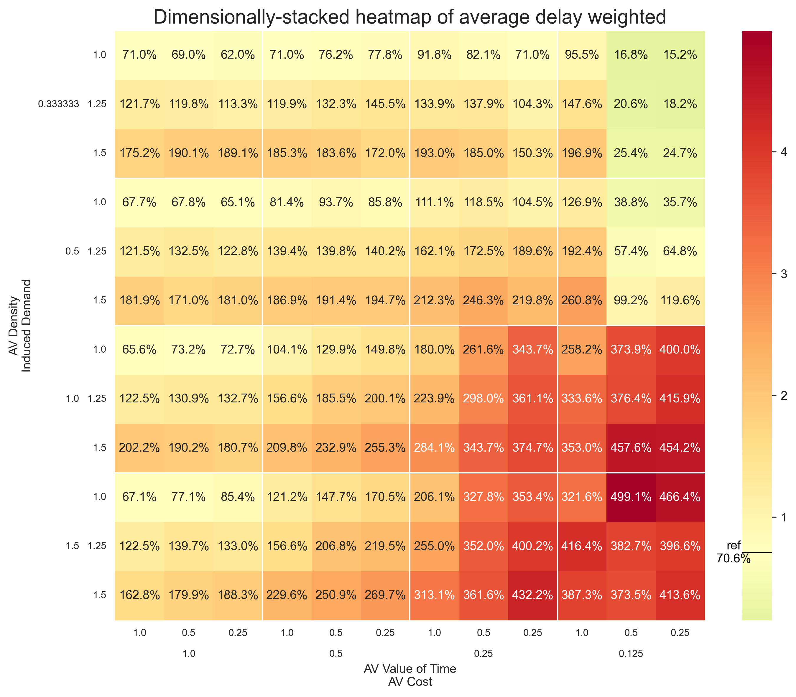

<div align="center">
<h1>When do autonomous vehicles solve or exacerbate different urban mobility problems?</h1>
<h3>A simulation study exploring modal shifts and system-level impacts in dense urban environments</h3>
</div>

# Abstract
**Background:** The introduction of autonomous vehicles (AVs) could fundamentally transform urban transportation, but their system-level effects on cities remain poorly understood. Previous research has focused primarily on individual adoption decisions or specific impacts like congestion, without capturing the complex interactions between adoption patterns, modal shifts, and transportation system performance.

**Goal:** This study investigates how autonomous vehicles might affect urban mobility problems, considering both modal shifts and induced demand, and examines which policies could effectively mitigate potential negative impacts while preserving benefits.

**Methods:** An agent-based model combined with mesoscopic traffic simulation was developed to simulate travel behavior in Rotterdam, Netherlands. The model explores 144 scenarios varying AV costs, perceived time value, space efficiency, and induced demand. Eight representative scenarios were then tested against nine policy combinations.

**Results:** AV adoption patterns depend more strongly on space efficiency than cost or comfort advantages. A critical threshold around a density factor of 0.5 emerged - below this threshold, high AV adoption can maintain system performance, while above it, increased adoption degrades network performance. AVs compete more directly with sustainable transport modes than with private cars. Traditional policy interventions showed limited effectiveness across different scenarios.

**Conclusions:** Autonomous vehicles may represent neither an inherent solution nor an inevitable problem for urban mobility. Their impact appears likely to depend on the interaction between their operating characteristics, adoption patterns, and policy frameworks. Results suggest that cities should focus on ensuring space-efficient AV operations rather than just regulating costs or access.

Keywords: autonomous vehicles, urban mobility, agent-based modeling, traffic simulation, mode choice, transportation policy, modal shift, induced demand

# 1. Introduction
The emergence of autonomous vehicles represents a fundamental challenge for transportation systems modeling. While previous technologies like ride-hailing services have demonstrated how new mobility options can reshape travel patterns, AVs introduce unprecedented complexity due to their potential to simultaneously affect mode choice, network capacity, and travel behavior. Recent research has highlighted the importance of understanding these interdependencies - Liu et al. (2022) demonstrated how AV fleet efficiency can significantly impact vehicle miles traveled and parking demand, while Wang et al. (2024) showed that modal shifts from AVs could fundamentally alter network equilibrium patterns. However, as Fakhrmoosavi et al. (2022) note, the uncertainty in key parameters like value of time reduction, induced travel demand, and operational efficiency creates significant challenges for predicting system-level impacts.

## 1.1 Technical challenges in modeling AV impacts
Three key technical challenges have limited previous attempts to model AV adoption and its systemic effects. First, modal shift modeling typically relies on stated preference surveys or simplified utility functions that may not capture how AVs' unique characteristics influence mode choice decisions. Recent work by Narayanan et al. (2022) has shown that integrating dynamic user equilibrium approaches with operational models can better represent these complex choice dynamics. Second, traffic simulation models generally treat AVs as either standard vehicles or ideally efficient ones, without capturing how varying levels of operational efficiency might create distinct system dynamics. Yan et al. (2020) demonstrated that fleet performance can vary significantly based on trip densities and operational constraints, suggesting the need for more sophisticated representation of AV operations. Third, the feedback between adoption patterns and network performance creates complex nonlinear effects that are difficult to capture with traditional equilibrium-based approaches.

Recent research has attempted to address these challenges individually. Wang et al. (2024) developed multimodal traffic assignment models considering heterogeneous demand patterns, but without capturing temporal dynamics. Fakhrmoosavi et al. (2022) proposed a stochastic framework for assessing network-level impacts but focused primarily on connected vehicle technologies. While these approaches have advanced our understanding of specific aspects, they have not fully integrated the multiple feedback loops between individual decisions and system performance.

## 1.2 Methodological Gaps
A key limitation of existing approaches is their inability to simultaneously model individual behavior and network effects while capturing the temporal dynamics of technology adoption. Agent-based models can represent heterogeneous decision-making but traditionally struggle with network-scale traffic dynamics. Conversely, traffic simulation models excel at network analysis but typically use simplified behavioral assumptions. While some studies have attempted to combine these approaches (e.g., Narayanan et al., 2022), they have generally relied on static assignment methods that miss important temporal effects.

Additionally, while recent work has made progress in understanding specific aspects of AV impacts - such as Liu et al.'s (2022) analysis of fleet efficiency or Yan et al.'s (2020) investigation of operational constraints - these studies have typically focused on either adoption prediction or impact assessment, without adequately capturing how these processes influence each other. Studies examining adoption patterns often assume fixed network conditions, while those modeling network impacts typically use predetermined adoption scenarios.

## 1.3 Research contribution
This paper addresses these methodological gaps by developing an integrated simulation framework that combines:
1.	A behaviorally-rich agent-based model capturing heterogeneous mode choice decisions
2.	A mesoscopic traffic simulation representing network-level dynamics
3.	A discrete event system enabling analysis of temporal feedback effects

Building on Fakhrmoosavi et al.'s (2022) approach to handling parameter uncertainty, we systematically explore how different AV characteristics might influence system outcomes. Our framework extends Narayanan et al.'s (2022) integration of transport modeling approaches while adding explicit consideration of operational efficiency thresholds identified by Yan et al. (2020).

## 1.4 Research objectives
The study addresses four specific technical objectives:
1.	Develop a validated model architecture integrating individual behavior and network dynamics
2.	Identify critical thresholds in AV operating characteristics that create distinct system behaviors
3.	Quantify how different AV characteristics influence competition with existing modes
4.	Evaluate the effectiveness of various intervention strategies across different adoption scenarios

## 1.5 Paper organization
The remainder of this paper is organized as follows: Section 2 describes the methodological approach, including the rationale for combining agent-based modeling with mesoscopic traffic simulation. Section 3 presents the model design and validation. Section 4 details the experimental design used to investigate different scenarios and interventions. Section 5 presents results examining adoption patterns, network effects, and intervention effectiveness. Section 6 discusses implications for transportation system modeling and planning, while Section 7 concludes with key insights and future research directions.

# 2. Methods
This study employs agent-based modeling (ABM) combined with mesoscopic traffic simulation to investigate the system-level effects of autonomous vehicle adoption in urban environments. We developed an integrated simulation framework combining agent-based modeling for individual travel decisions with mesoscopic traffic simulation for network dynamics, enabling analysis of feedback loops between adoption patterns and system performance. This hybrid approach was chosen over alternatives like pure equation-based approaches or aggregated flow models because it allows explicit representation of heterogeneous decision-making while capturing emergent system behavior from individual choices at the scale required for city-wide analysis. Alternative methods like system dynamics could capture some feedback mechanisms but would miss the spatial granularity and heterogeneity essential for understanding urban mobility patterns.

## 2.1 Modeling framework
The modeling approach consists of three interconnected layers that address different aspects of the research questions. The first layer contains dynamic processes - the daily movements of travelers choosing transport modes and navigating through traffic, with continuous feedback between individual decisions and network conditions. The second layer includes experimental variables representing key uncertainties about autonomous vehicles (cost, perceived time value, space efficiency, and induced demand) and potential policy interventions, which remain constant during each simulation but are systematically varied between simulations to explore different future scenarios. The third layer provides validated baseline data including population distribution, road networks, and travel patterns, which remains constant across all scenarios to ensure meaningful comparisons between different policy and technology scenarios.


_Fig 3.2: Conceptual model displaying the submodels, variables and their interactions_

The model builds upon the traditional four-step transportation demand model (McNally, 2007) but implements it within an agent-based, discrete-event framework. The first two steps - trip generation and trip distribution - are derived from empirical data to ground the model in validated travel patterns. Trip generation rates come from the Dutch National Travel Survey (ODiN 2023), while trip distribution uses origin-destination matrices from the V-MRDH transport model. The latter two steps - mode choice and route assignment - are modeled dynamically through agent behavior and traffic simulation, enabling investigation of how travelers might respond to new mobility options while maintaining computational tractability.

For mode choice, we employed a rational utility-maximization approach based on perceived costs (including both monetary costs and time weighted by individual value of time) rather than more complex choice models. This choice was driven by three key considerations: the lack of stated preference data for AVs made calibrating more complex choice models speculative, the research focus on system-level effects meant that capturing broad behavioral patterns was more important than precise individual choices, and the value of time framework provides a clear mechanism for exploring how AVs might change travel behavior through reduced perceived time costs. While this approach simplifies some aspects of real-world decision making, it captures the essential trade-offs between time, cost, and comfort that drive mode choice.

The mesoscopic traffic simulation approach was selected as a middle ground between microscopic and macroscopic models. While microscopic simulation could provide more detailed vehicle interactions, it would be computationally prohibitive at the city scale needed for this research. Conversely, macroscopic models would miss important dynamics like intersection delays and route choice that affect system performance. The mesoscopic approach provides sufficient detail to capture congestion effects and travel time variations while remaining computationally tractable for the large number of scenarios explored in this study.

## 2.2 Study area and data
Rotterdam, Netherlands was selected as representative of medium-sized European cities with diverse transport options and current mobility challenges. The study area encompasses approximately one million residents across 125 four-digit postal code (PC4) areas, which roughly correspond to neighborhoods. This resolution provides sufficient granularity to capture heterogeneity in population densities, car availability, and travel patterns while creating 15,500 possible origin-destination pairs for trips. These postal code areas are nested within 21 larger traffic analysis zones from the V-MRDH transport model, allowing for integration with regional travel demand data and validation against existing mobility patterns.

Rotterdam was chosen for several specific reasons beyond representativeness. Its size makes it large enough to exhibit complex urban mobility patterns while remaining computationally manageable. It currently faces typical urban transportation challenges including congestion, parking scarcity, and competing demands for limited road space. The city offers a diverse transportation ecosystem with well-developed alternatives to car travel, including extensive public transit (buses, trams, and metro) and significant cycling infrastructure, making it ideal for studying modal shifts. Additionally, it has relatively high car usage for a major Dutch city, enabling potential modal shifts from all modes.


_Fig 3.1: The main study area, divided into 21 MRDH regions and 125 postal code areas_

Simulations run from 05:00 to 24:00 with 5-minute time steps to capture both peak and off-peak travel patterns, covering all significant periods of travel activity. The excluded overnight period accounts for less than 1% of daily trips according to ODiN data. The model uses discrete event simulation to activate agents with high temporal precision, with individual agents initiating trips at any point in continuous time based on ODiN-derived hourly probabilities distributed uniformly within each hour.

The road network, derived from OpenStreetMap (September 2024), comprises 1,575 nodes and 3,328 edges including all roads from tertiary level upward. This network structure balances detail and computational efficiency - major and minor arterials are included to accurately model traffic flow, while local streets are omitted as their impact on system-level dynamics is minimal. The network includes planned infrastructure improvements like the new A16 motorway and Blankenburg tunnel to ensure relevance for near-future scenarios.


_Fig 3.3: The road network used in the traffic simulation_

### Data sources and processing
Multiple data sources were integrated to enable realistic simulation of both individual travel decisions and emergent system-level effects. Population distribution and vehicle ownership data from CBS (2023) were used at the PC4 level, with car ownership varying significantly by area (19-65%, averaging 31.5%). The simulation represents approximately one million residents with each agent representing a platoon of 10 actual travelers for computational efficiency.

Origin-destination matrices from the V-MRDH transport model provide spatial trip distribution for different time periods (morning peak, evening peak, and off-peak). These matrices were processed to create probability distributions for trip destinations given each origin based on all transportation modes combined, allowing mode choice to be modeled internally as an agent decision rather than using mode-specific matrices.

Travel times and costs for non-car modes were collected using the Google Maps Distance Matrix API for all 15,500 possible origin-destination pairs, captured on a typical Thursday morning (September 17, 2024, 08:00). For cars, travel times are calculated dynamically by the traffic simulation based on network conditions. Travel costs were derived from multiple sources: variable car costs of €0.268/km based on Nibud data, distance-based public transit pricing following NS tariff structure (€0.169/km base rate), zero marginal cost for bicycles, and AV pricing based on Waymo's September 2024 rates in Los Angeles (€3.79 base fare plus €1.41/km and €0.40/min).

Value of time parameters were derived from KiM (2023): €10.42/hour for cars, €10.39/hour for bicycles, €7.12/hour for public transit, with AV values scaled using adjustable factors explored in scenarios. Individual heterogeneity was introduced through agent-specific value of time factors drawn from a lognormal distribution (mean 1.0, standard deviation 0.5, capped at 4.0), for heterogeneous time valuations with a reasonable upper bound.

## 2.3 Model components
The model implements individual mode choice decisions within a dynamic traffic environment, capturing both immediate responses to network conditions and longer-term adoption patterns. The process begins with input data feeding into both agent behavior and traffic simulation, creating information flows and feedback loops between individual travel decisions and system-level traffic dynamics.

### Agent behavior
Agents represent individual travelers with heterogeneous characteristics including home location, car ownership, possession of driver's license, and value of time. Each agent generates trips based on empirically-derived hourly probabilities, with destinations chosen according to origin-destination matrices that vary by time period to capture different travel patterns throughout the day.

Mode choice is implemented through a rational choice model where agents choose between available modes (conventional car, autonomous vehicle, bicycle, public transit) based on minimizing comfort-adjusted perceived costs. The perceived cost $C_{p,m}$ for a trip using mode $m$ is calculated as:

$$C_{p,m} = (C_{m,m} + T_m \cdot V_m) \cdot \alpha_m$$

where $C_{m,m}$ is the monetary cost for mode $m$, $T_m$ is the travel time for mode $m$, $V_m$ is the individual value of time for mode $m$, and $\alpha_m$ is the comfort factor for mode $m$. The comfort factor allows representation of mode-specific preferences beyond time and cost considerations.

Mode availability is constrained by individual characteristics (car ownership, driver's license possession) and previous trip choices. Trip chains are implemented as simple two-leg journeys (outbound and return), with mode availability constrained by previous choices - for example, if departing by car, the return trip must also be by car as the vehicle needs to return home.

### Traffic simulation
The traffic simulation component uses UXsim, a mesoscopic traffic simulator that implements Newell's simplified car-following model. This model represents traffic flow as a kinematic wave, balancing computational efficiency with sufficient detail to model traffic dynamics and measure congestion at both link and network levels.

When agents choose car or AV as their travel mode, they are added to the traffic simulation as vehicles. For computational efficiency, vehicles are grouped into platoons of 10 vehicles, approximating the behavior of the actual 991,575 residents with approximately 100,000 agents. Each vehicle's driving behavior on a link is expressed as:

$$X(t + \Delta t, n) = \min\{X(t, n) + u\Delta t, X(t + \Delta t - \tau \Delta n, n - \Delta n) - \delta\Delta n\}$$

where $X(t, n)$ denotes the position of platoon $n$ at time $t$, $\Delta t$ denotes the simulation time step width, $u$ denotes free-flow speed of the link, and $\delta$ denotes jam spacing of the link. This equation represents vehicles traveling at free-flow speed when unconstrained, while maintaining safe following distances when in congestion.

Traffic behavior at intersections is handled by the incremental node model, which resolves conflicts between competing flows by processing vehicles sequentially based on predefined merge priorities. Since OpenStreetMap data lacked explicit intersection information, merge priorities were set to default values, giving each incoming lane equal priority. Road characteristics are differentiated by road type, with motorways having lower jam densities (0.14 vehicles/meter/lane) than local streets (0.20 vehicles/meter/lane).

Route choice employs a Dynamic User Equilibrium (DUO) model with stochasticity and delay. The attractiveness $B^{z,i}_o$ of link $o$ for vehicles with destination $z$ at time step $i$ is updated as:

$$B^{z,i}_o = (1 - \lambda)B^{z,i-\Delta i_B}_o + \lambda b^{z,i}_o$$

where $\lambda$ is a weight parameter and $b^{z,i}_o$ indicates whether link $o$ is on the shortest path to destination $z$. This formulation allows vehicles to gradually adapt their routes based on evolving traffic conditions, rather than instantly responding to changes in travel times.

The model creates feedback loops where traffic conditions influence mode choices: when agents choose conventional cars or AVs, their trips feed into the mesoscopic traffic simulation as vehicle demand. The traffic simulation then calculates network conditions including congestion, delays, and travel times, which feed back into agents' future mode choices through updated travel times. For non-motorized modes and public transit, travel times remain fixed based on Google Maps API data, as these modes are assumed to be largely unaffected by car traffic congestion.

## 2.4 Model validation
The model reproduces key characteristics of current Rotterdam travel patterns while revealing limitations that inform result interpretation. Model verification and validation followed a systematic approach combining multiple techniques including continuous integration testing, version control with detailed validation notes, and systematic comparison against empirical data.

Default behavior was validated against ODiN 2023 data for the Rotterdam area. In the inner city areas (Noord, Kralingen, Rotterdam Centrum, Feyenoord, Delfshaven), the model produces mode shares of 11.3% car, 82.3% bicycle, and 6.5% transit, compared to empirical values of 13.4%, 69.9%, and 16.7% respectively. For the broader study area, the model shows 25.4% car, 65.1% bicycle, and 9.5% transit usage, versus empirical values of 37.7%, 49.0%, and 13.3%.

While the model shows deviation from empirical data, particularly overestimating bicycle usage and underestimating car use, these differences are consistent with the model's focus on short to medium-term effects. The model doesn't capture certain car-favoring factors like weather, cargo requirements, and multi-stop trips, which likely explains the lower car mode share. However, the relative order of mode preferences and general patterns align with observed behavior, suggesting sufficient validity for examining modal shifts.


_Fig 3.5: Distributions of trip travel time, costs and perceived costs by mode in the default scenario_

Temporal travel patterns show strong alignment with empirical data, particularly in capturing peak hour characteristics. The model reproduces the sharp morning peak (8:00-9:00) and broader evening peak (16:00-18:00) observed in ODiN data, both in terms of timing and relative magnitude. Trip distance distributions follow expected log-normal patterns, with bicycles dominating shorter trips (1-5 km) and motorized modes becoming more prevalent at longer distances.


_Fig 3.4: Mode share during the day in the default scenario_

The traffic simulation demonstrates plausible behavior in several key aspects. Known congestion points, such as the Algera bridge bottleneck in Krimpen aan den IJssel and the Terbregseplein interchange, show appropriate congestion patterns. The model captures expected phenomena like longer delays during evening peaks compared to morning peaks, and higher congestion in dense urban areas versus peripheral regions. Network speeds average 25 km/h in the default scenario, decreasing to 10-15 km/h in congested inner-city areas during peak hours, which aligns with typical urban traffic patterns.


_Fig 3.6: Network performance metrics by geographic area during the day in the default scenario_

### Validation limitations
Several validation limitations should be noted that inform result interpretation. The model lacks detailed validation of intersection-level traffic dynamics due to computational constraints and data availability. The validity of AV-related behavioral assumptions cannot be directly verified due to the emerging nature of the technology - the model necessarily relies on theoretical relationships and assumptions about how people might respond to AVs based on current mode choice patterns. The model's prediction of induced demand effects relies on theoretical relationships rather than empirical validation, as historical data on transportation improvements of this magnitude are limited.

Additionally, the model simplifies several aspects of real-world travel behavior. Agents do not learn from or adapt based on previous experiences, and there are no direct agent-to-agent interactions. The mode choice model implements a simplified rational choice framework that may not fully capture habitual behavior, psychological factors, or complex preferences beyond the comfort factor. Despite these limitations, the model demonstrates sufficient validity in its core components to meaningfully examine system-level effects of AV adoption.

## 2.5 Experimental design
We explored 144 scenarios varying four key AV uncertainties, then tested policy interventions across eight representative scenarios. The experimental design employed two main analyses: a comprehensive scenario analysis investigating uncertainties in AV adoption and system effects, and a focused policy analysis testing interventions across selected scenarios.


_Fig 4.1: Conceptual model including scenario uncertainties and policy levers_

### Scenario analysis
The scenario analysis employed a full-factorial design to systematically explore interactions between key uncertainties while maintaining interpretability of results. This approach was chosen over alternatives like Monte Carlo or Latin Hypercube sampling because factorial designs enable systematic exploration of interactions between variables while maintaining interpretability - each scenario represents a clear combination of parameter values that can be directly compared to others. The logarithmic spacing of certain variables allows exploration of non-linear effects that might be missed with uniform sampling.

Four key uncertainties were examined based on literature review and stakeholder consultation as the factors most likely to influence adoption patterns or cause interesting system-level effects:

1. **AV Cost Factor** (4 levels: 1.0, 0.5, 0.25, 0.125): Relative cost compared to current Waymo pricing in Los Angeles as of September 2024. The logarithmic spacing reflects the expectation that cost differences matter more at lower price points, where they might trigger significant changes in adoption patterns. The range spans from current prices to one-eighth of current costs.
2. **AV Value of Time Factor** (3 levels: 1.0, 0.5, 0.25): Perceived value of time spent in AVs versus conventional vehicles. A factor of 1.0 represents equivalent time value to current cars, while lower values represent scenarios where time in AVs is perceived as less costly due to the ability to work, rest, or engage in other activities during travel.
3. **AV Density Factor** (4 levels: 1.5, 1.0, 0.5, 0.333): Space efficiency of AVs relative to conventional vehicles, measured as the space required per person transported. Values above 1.0 indicate less efficient operation due to increased safety margins or lower occupancy, while values below 1.0 represent improved efficiency. This efficiency could be achieved through various mechanisms: higher occupancy from better ride-matching, reduced following distances through platooning or faster reaction times, smaller vehicles optimized for urban trips, or combinations thereof. By treating density as an outcome-based metric rather than specifying implementation details, the model remains relevant regardless of which technological solutions emerge.
4. **Induced Demand** (3 levels: 1.0, 1.25, 1.5): Potential increase in overall travel demand based on historical precedent from major transportation improvements. The range captures both conservative estimates (no increase) and aggressive estimates (50% increase) of how improved mobility might stimulate additional travel demand, accounting for both demand growth from improved AV services and external factors.

This design created 144 unique combinations (4×3×4×3), each representing a possible future scenario simulated for a full day (19 hours) while base parameters like the road network configuration, population distribution and external traffic patterns were kept constant.

### Policy analysis
Eight representative scenarios were selected from the scenario analysis results to span the range of plausible futures identified, with particular attention to cases that showed interesting or concerning system-level effects. The scenarios range from "current situation" to "extreme progress" in AV adoption, including both optimistic scenarios where technological progress leads to efficient, affordable AVs, and more problematic scenarios where cheap but inefficient AVs could create new urban challenges.

The selected scenarios include current situation (av_cost_factor: 1.0, av_density: 1.5, induced_demand: 1.0), moderate progress (0.5, 1.0, 1.125), extensive progress (0.25, 0.5, 1.25), extreme progress (0.125, 0.333, 1.5), and several "race to bottom" scenarios exploring different density outcomes with very cheap AVs. These scenarios were tested against nine policy combinations examining both individual and combined effects of two main intervention types: speed reductions and congestion pricing.

| Scenario | `av_cost_factor` | `av_density` | `induced_demand` |
|----------|------------------|--------------|------------------|
| Current situation | 1.0 | 1.5 | 1.0 |
| Moderate progress | 0.5 | 1.0 | 1.125 |
| Extensive progress | 0.25 | 0.5 | 1.25 |
| Extreme progress | 0.125 | 0.333 | 1.5 |
| Private race to bottom | 0.125 | 1.5 | 1.25 |
| Mixed race to bottom | 0.125 | 1.0 | 1.25 |
| Shared race to bottom | 0.125 | 0.5 | 1.25 |
| Dense progress | 0.25 | 0.333 | 1.125 |

_Table 4.1: Overview of selected scenarios for policy analysis_

The policy combinations were designed to test both spatial and temporal variations in intervention strategies. Speed reductions of 20 km/h represent significant but feasible changes in urban speed limits, consistent with policies being implemented in cities like Amsterdam. Pricing levels (€5 and €10) were chosen to be substantial enough to influence behavior while remaining within ranges seen in existing congestion pricing schemes.

Geographic targeting included two spatial scales: the "autoluw" area representing Rotterdam's central low-traffic zone (affecting about 13% of the population), and city-wide implementation covering all 125 postal code areas. Temporal variations explored peak-hour (7:00-9:00 and 16:00-18:00) versus all-day (6:00-19:00) implementation, using current Dutch definitions for peak hours and daytime periods.

| Policy | Area | Speed Reduction | Tariff (€) | Timing |
|--------|------|-----------------|------------|---------|
| No policy | City | None | 0 | - |
| Autoluw peak | Autoluw | -20 km/h | 5 | Peak |
| Autoluw day | Autoluw | -20 km/h | 5 | Day |
| City peak | City | -20 km/h | 5 | Peak |
| City day | City | -20 km/h | 5 | Day |
| City speed only | City | -20 km/h | 0 | - |
| City peak tariff | City | None | 5 | Peak |
| City day tariff | City | None | 5 | Day |
| All out | City | -20 km/h | 10 | Day |

_Table 4.2: Overview of policy combinations for policy analysis_

This created 72 scenario-policy combinations (8×9), enabling examination of policy effectiveness under different future conditions. Each combination was evaluated using multiple metrics including mode shares, network performance, and total vehicle kilometers traveled, allowing analysis of both intended and unintended policy effects. Results were collected on journey details (origin, destination, mode, costs), traffic conditions (speed, density, flow), and parking occupancy, enabling comprehensive analysis of system-level effects.

# 5. Results
This section presents the findings from two major experiments: a full-factorial analysis exploring 144 scenarios of AV adoption, and a focused policy analysis testing 72 combinations of scenarios and interventions. The results are organized in three parts that directly address our research subquestions.

First, Section 5.1 examines AV adoption patterns and modal shifts across different scenarios, answering subquestion B about how self-driving cars will be adopted under different uncertainties. Section 5.2 analyzes the system-level effects including congestion, network performance, and total vehicle kilometers traveled, addressing subquestion C about which urban problems are amplified or reduced by AVs. Both are based on the scenario analysis as described in section 4.1, but looking at different outcome metrics.

Finally, Section 5.3 evaluates the effectiveness of various policy interventions across different scenarios, answering subquestion D about which policies can effectively mitigate negative impacts while preserving benefits. This section is based on the policy analysis as described in section 4.2.

| Section                        | Subquestion | Experiment        | Metrics                                                                           |
|--------------------------------|-------------|-------------------|-----------------------------------------------------------------------------------|
| 5.1: AV adoption & modal shift | B           | Scenario analysis | AV mode share, mode-distance share, modal shift patterns                          |
| 5.2: System effects            | C           | Scenario analysis | Network performance, congestion levels, vehicle kilometers traveled, travel times |
| 5.3: Policy effectiveness      | D           | Policy analysis   | Mode shares, network performance, system-wide metrics                             |

_Table 5.1: Overview of which section answers which subquestion by which experiment examining which metrics_

### Interpreting the results
Many of the results will be displayed in dimensionally-stacked heatmaps. In each, one metric is displayed for all 144 scenarios. There are two x-axes and two y-axes, one for each of the 4 uncertainties from which the scenarios are derived:
- Inner (upper) x-axis: The AV Value of Time (VOT) factor, ranging from 1.0 to 0.25 (lower means less valuable).
- Outer (lower) x-axis: The AV Cost Factor, ranging from 1.0 to 0.125 (lower means cheaper).
- Inner (left) y-axis: Induced Demand factor, ranging from 1.0 to 1.5 (higher means more demand).
- Outer (right) y-axis: AV Density factor, ranging from 1.5 to 0.333 (lower means less space per person kilometer taken up).

Each value (tile) in the heatmap represents the metric value for the corresponding scenario. The structure and order is identical for all heatmaps, allowing for visual comparison of different metrics across the scenarios. Generally, outcomes preferred by (most) stakeholders are displayed in green, while undesired outcomes are displayed in red, with the reference scenario (no AVs) being the yellow midpoint. If the preferred direction of a metric is not clear, brown indicates low values and blue indicates high values, with white being the reference scenario.

## 5.1 AV adoption & modal shift
To understand how autonomous vehicles might be adopted in urban environments and their impact on existing transportation modes, we first analyze the uptake of AVs and resulting changes in mode shares across our scenario space. This will answer subquestion B, under which circumstances AVs are likely to be adopted and how they affect the use of other modes.

### AV adoption
Fig 5.1 shows the mode share and mode-distance share of AVs in the 144 scenarios. The mode share represents the percentage of total trips made by AVs, while the mode-distance share represents the percentage of total distance traveled by AVs.

|  |  |
|-----|-----|

_Fig 5.1: Mode share and mode-distance share of AVs in different scenarios_

In the scenarios to close to current pricing, AVs are only marginally adopted, for between 0.7% and 1.6%. While this is between 25.000 to 60.000 daily trips, it's not significant in the total of 3.5 million daily trips in the area. The density factor plays a small but notable role here, with AV adoption being about half if total travel demand increases by 50%.

While the AV density and passenger's value of time have some effect on the adoption of AVs, reducing the costs is what really drives AV adoption. Halving the costs increases the adoption by more than 5x, floating between 5 and 12 percent. Halving it again leads to another major increase up to 33%, which is also the first time the AV density starts to play a significant role. A density of 0.5 or 0.333 leads to significantly higher adoption, which will be further explorer in section 5.2. 

The AV distance share, which is the share of total distance traveled by AVs, shows very similar patters, being a slightly higher in the high-adoption scenarios.

Finally, with the price being reduced to one-eight (0.125) or the current costs, AVs are cheap enough to be massively adopted. However, this has two pre-requisites: the value of time has to be at most 0.5, and the density has to be at most 0.5. With an density of 1.0 or 1.5 or a value of time of 1.0, the adoption is still significant in the 15 to 35 percent ranges, but won't reach the massive 65%+ adoption that otherwise is reached.

### Modal shift
Fig 5.2 shows the mode share of cars, bicycles, and public transit in the 144 scenarios, which allows us to see how the adoption of AVs affects the use of other modes.

|  |  |  |
|-----|-----|-----|

_Fig 5.2: Mode share of cars, bicycles, and public transit in different scenarios_

Looking at the mode shares of the other modalities, we see again those two distinct futures depending on the density of AVs. If AVs operate inefficiently, bike and transit shares remain high, and car share slightly reduces as AVs get cheaper. However, with high density AVs, bike and transit share drop very steeply while car share remains relatively high. Notably, there even is a spot in which the car share increases, with very high density AVs that are still relatively expensive (a cost factor of 0.5 or 0.25). We will explore this further in 5.2.

It's also remarkable that as AVs get cheaper and more dense, the modal shift from cyclist and transit starts earlier and happens faster than the modal shift from cars.

Finally, the induced demand doesn't seem to matter very much for the mode shares. While in the likely near-future scenarios with expensive AVs the induced demand lowers car and AV share with high induced demand, as AVs get cheaper and adoption increases, the density dictates the mode shares more than the induced demand.

## 5.2 System effects
With the modal shift and AV adoption patterns established, we now turn to the system-level effects of these changes. This section addresses subquestion C, exploring which undesired urban problems are amplified or reduced by the introduction of self-driving cars.

### Road network performance and congestion
Fig 5.3 shows the average car speed, average AV speed, and average network speed in the 144 scenarios. These metrics provide insights into the overall efficiency of the road network and the impact of AV adoption on traffic flow.

|  |  |  |
|-----|-----|-----|

_Fig 5.3: Average car speed, average AV speed, and average network speed in different scenarios_

In almost all scenarios, the average car speed is reduced compared to the reference scenario without AVs. While about 25 km/h in the reference scenario, it drops to about 18 km/h with 25% more overall demand and below 15 km/h with 50% more demand, suggesting significant congestion. AVs get cheaper, mean car speeds slow down further, in some cases below 5 km/h. With very cheap AVs we see the a similar split as before: with a density of 1.5 and 1.0 the city comes to a griding halt, while a density of 0.5 boosts the speeds back to the reference scenario, suggesting that AVs add about as much road capacity as they take up. Only with a density of 0.333, the speeds are significantly higher than the reference scenario, suggesting that AVs can significantly increase road capacity.

AV speeds show many of the same traits: Higher induced demand lowers speed, cheaper AVs also lower speed, and the same density split, but with one remarkable difference: with a density of 0.333, average AV speeds are significantly higher than the cars. Especially when AVs are expensive, this suggests that people only use AVs when they are relatively fast, and provide significant time savings over bicycles and public transit. As AVs get cheaper, their average speed drops, suggesting both net congestion and that people are taking AVs also for trips with less time savings. Especially with an AV cost of 0.25, the AV VOT factor has very significant impact on the AV speed, suggesting that people with a low VoT are willing to take AVs even if they are slower than other, more expensive modes (including cars).

Finally, the average speeds of all vehicles on the network show the same trend, with it being notable that network speeds will only increase when AVs are both very cheap and very dense. All other scenarios show a significant decrease in network speed, with the most extreme scenarios showing speeds well below 10 km/h.

Figure 5.4 shows the average delay compared to free-flow speeds, and shows very similar patterns. In the reference scenario, vehicle trips take about 70% more time than when they would be able to travel at free-flow speeds. This increases to 120% and almost 200% with 25% and 50% more demand, respectively. Cheaper AVs don't provide any benefits until they are prices below one eight of the current pricing, and only with a density of at least 0.5. Densities of 1.0 and 1.5 in that case can blow up average delays to over 500%, meaning only one-sixth of the average free-flow speed is achieved.

<div align="center">
    
</div>

_Fig 5.4: Average delay (compared to free flow) in different scenarios_

### Vehicle distance traveled
Total vehicle distance traveled is useful as a high-level metric because it can act as a proxy for many other metrics, like congestion, emissions, energy use, and wear and tear on the road network. Fig 5.5 shows the total network distance traveled and the average network delay in the 144 scenarios.

<div align="center">
    
</div>

_Fig 5.5: Total network distance traveled and average network delay in different scenarios_

Interesting, the total network distance traveled only increases slightly with more demand in scenarios with close to current pricing, indicating the network is already close to its maximum capacity. With AVs getting cheaper and adopted, we see the same split as in previous metrics, but in a surprising direction. The total vehicle distance decreased significantly, to under half of the reference scenario, with very cheap AVs and non-dense AVs. While maybe surprising on the surface level, it is consistent with the conceptual model: Slow moving vehicles don't cover a lot of distance, and a city in gridlock doesn't move a lot of vehicles.

With higher densities, cheap AVs and low value of time, the induced demand starts to matter a lot more, scaling practically linearly with the induced demand factor. This suggests that the speeds on the network are sufficient to accommodate all vehicles that want to travel, leading to large distances covered.

Especially the implication of high speeds with high milage could have severe negative effects in a city. Even if only EVs are considered and not the negative externalities of ICE cars, collisions causing injuries, energy usage, noise pollution, road wear and tear, and microplastics from tire wear could all be significantly increased.

### Travel time and perceived costs
Finally, it's interesting to look at the average travel time and the perceived costs of the trips, since those are two of the potential benefits of AVs. These are shown in Fig 5.6.

|  |  |
|-----------------------------------------------------------------------------------------------------------------------------------------------------------------------|-----|

_Fig 5.6: Average travel time and average perceived costs in different scenarios_

The mean travel time degrades immediately with induced demand. Without any induced demand, we see average travel times increase relatively soon, with an AV costs of 0.5 already leading to notable decreases, as long as the density is 0.5 or 0.333. With a density of 1.0 or 1.5, the opposite happens, and there isn't a single scenario in which AVs with that density improve average travel times. The huge potential of AVs are reached if the density reaches 0.333, almost slashing the average travel time for all travelers in half. A density of 0.5 is also enough as long as induced demand is low.

One very interesting observation is that the AV Value of Time is really important in that last case, and that deserves some further explanation. If the VoT factor for AVs is 0.5 or lower, we see that the AV travel times massively decrease, but not if the VoT factor is 1.0. Understanding this requires looking back at Fig 5.2, which shows a large modal shift from cars to AVs only occurs with those lower VoTs. So if the AV VoT factor is still 1, a significant shift from bikes and public transit to AVs happens, increasing AV share to around 30%, but most people keep driving their cars, and some people even shift from other modalities to cars. This means the total number of regular cars on the road is not reduced and in a few cases even increases, while adding some AVs to the mix. Even if these AVs have optimal density, it still leads to a net increase in car density and thus an increase in congestion and travel times.

The results in the lower right corner indicate that the metrics improve somewhat again as AVs get cheaper and VoT gets lower, but this isn't the case. For both metrics the results there should be disregarded, since not enough travelers were even able to finish their journey to give a representative picture of these two metrics (data for these metrics could only be collected when a journey was finished, and many travelers simply weren't able to before the simulation ended at midnight).

## 5.3 Policy effectiveness
To address subquestion D about which policies can help mitigate negative impacts of AV adoption while preserving benefits, we evaluated the effectiveness of eight representative scenarios under nine different policy combinations as described in [Section 4.2](#42-policy-analysis). This section presents the results of the policy analysis, focusing on the impact of speed limit reduction and congestion pricing policies on mode shares, network performance, and total vehicle kilometers traveled.

Similar heatmaps as in the previous sections are shows, but now with the different scenarios on the y-axis and the different policies on the x-axis. Ideally, a policy would lead to better outcomes than the reference policy of doing nothing.

### AV adoption and modal shift
Fig 5.7 shows the mode share of cars, AVs, bicycles, and public transit in the 72 scenario-policy combinations. This allows us to see how the policies affect the adoption of AVs and the use of other modes.

|  |  |
|-----|-----|
|  |  |

_Fig 5.7: Mode share of cars, AVs, bicycles, and public transit in different scenarios and policies_

All policies do reduce the AV share, except the speed reduction on its own (even when applied to the whole city, like in policy 5). The comprehensive all out policy, which induces a high €10 tariff on all AV trips within the city and reduces the speed limit by 20 km/h on all roads, reduces AV share the most in all scenarios, bringing it down to about 10% at most. The city-day policy (8), proves the AV share can also be significantly reduced with a lower tariff, and the city-day-tarif policy (7) shows that the speed reduction is not necessary, a city wide tarif dusing the day (6-19h) is reduces AV share on its own.

Looking at the other modalities, the policies mostly dampen the modal shifts from the other modalities to AVs. In some cases, the policies decrease bike and transit use, which is likely caused by reduced congestion and thus more regular car use, but this will be further explored in the next section. None of the policies actually reduce car use, and in some cases even increase it.

### System effects

#### Network performance

|  |  |
|-----|-----|
|  |  |

_Fig 5.8: Average car speed, average AV speed, average network speed, and average delay in different scenarios and policies_

Most policies are surprisingly ineffective in increasing the average car speed, except mainly the all-out (8) and the city-day (4) policies, somewhat. It shows that a city wide tariff combined with a maximum speed reduction can increase car speeds in the moderate-progress and private- and mixed-race-to-the-bottom scenarios (1, 4 and 5). A tariff on its own (7) is less effective, and all other policies don't noticeably help car speeds, showing the small "autoluw" area and tariffs only at rush hours are not very effective.

AV speeds don't share this trend, and get almost universally worse with each policy in each scenario. Only policy 7, with only a tariff, can get AV speeds up in some scenarios, likely because relatively more fast routes are taken, since network speeds don't show significant improvements.

Finally, there is no policy that improves any of the speed metrics in each scenario. Policies that help in heavily congested scenarios, mainly by getting inefficient AVs off the road, do active harm in other scenarios, where high-density AVs get replaced with cars that are less efficient. No strategy is dominant on any metric, let alone on all. There is no silver bullet.

Note that the delay metric is lower with the speed limit reduction, but the average network speed is also lower. This is due to the way delay is measured: it's a ratio of the actual travel time divided by the free-flow travel time. If the free-flow travel time is higher (due to the speed limit reduction), the delay will be lower, even if the actual travel time is higher. It might influence the perception of congestion, since the difference between the actual travel time and the free-flow travel time is smaller, but it doesn't actually reduce congestion.

#### Vehicle distance traveled

<div align="center">
    
</div>

_Fig 5.9: Total network distance traveled and average network delay in different scenarios and policies_

Vehicle distance traveled is a very mixed bag. A few more drastic policies, like the city-day (4) and all-out (8) increase the distance traveled on practically in all cases. These were the policies that were effective in increasing network speeds, which shows here.

No policies effectively reduce vehicle distance. It shows that more comprehensive policies are needed that also target other modalities than AVs, which also might need to be more fine-grained, dynamic and/or adaptable if reducing vehicle milage is a goal.

#### Travel time and perceived costs

|  |  |
|------------------------------------------------------------------------------------|-----|

_Fig 5.10: Average travel time and average perceived costs in different scenarios and policies_

There is no single policy that manages to reduce travel time significantly. It shows just slapping a price and speed reduction on AVs at some time in some area doesn't help in that regard. Only in the moderate and extensive progress scenarios (1 and 2) some of the more aggressive policies seem to reduce travel times slightly, with notably the city-peak pricing policy (3) having a positive effect for the first time.

Perceived costs show a largely the same patterns, but in this case the more comprehensive policies (4 and 7, 8) are able to reduce the perceived costs somewhat in scenarios 1, 2 and 7. In all other scenarios and all other policies generally increase the perceived costs, showing again that there is no silver bullet.

### 5.4 Overview
The results from the scenario and policy analysis delivers some distinct insights in how autonomous vehicles might be adopted, what the potential undesired effects are, and which policies might help mitigate those effects. The main findings are:

First, AV adoption appears to be primarily driven by cost, with significant adoption only occurring when costs drop below half of current levels. The value of time spent in AVs plays a secondary but important role, particularly in determining whether people switch from cars to AVs. When AVs are very cheap (one-eighth of current costs) and time is perceived as more valuable in them (VOT factor of 0.5 or lower), adoption can reach over 65% of trips. However, this high adoption scenario only materializes if AVs can operate efficiently (density factor of 0.5 or lower).

Second, the density of AVs emerges as a critical factor that creates two distinct futures. With inefficient AVs (density factors of 1.0 or 1.5), increased adoption leads to severe congestion, with average network speeds dropping below 10 km/h in extreme cases. Conversely, with efficient AVs (density factors of 0.333 or 0.5), the system can accommodate high adoption while maintaining or even improving traffic flow. This bifurcation suggests that the success of AVs in urban environments may depend more on their space efficiency than their cost or comfort advantages.

Third, the modal shift patterns reveal that cyclists and transit users are more likely to switch to AVs than car users when AVs become cheaper. This suggests that AVs might compete more directly with sustainable transport modes than with private cars, potentially undermining urban sustainability goals. The effect is particularly pronounced when AVs are both cheap and space-efficient, leading to significant reductions in bicycle and transit mode shares.

Fourth, induced demand plays a complex role. Its effects are most noticeable in scenarios with efficient AVs, where the additional capacity enables the system to accommodate more trips. In scenarios with inefficient AVs, the system is already so congested that induced demand has limited additional impact. This suggests that the relationship between AV adoption and induced demand is non-linear and heavily dependent on AV operating characteristics.

Fifth, vehicle distance traveled reveals complex patterns depending on AV efficiency and speed. In scenarios with inefficient AVs (density 1.0-1.5), total vehicle kilometers decrease significantly as congestion reduces speeds, sometimes to less than half the reference scenario. Conversely, with efficient AVs (density 0.333-0.5), vehicle kilometers can increase substantially, scaling almost linearly with induced demand. This divergence is particularly pronounced when AVs are very cheap (cost factor 0.125) and perceived time costs are low (VOT factor 0.25-0.5), suggesting that efficiency improvements could lead to significantly more vehicle travel.

Sixth, policy analysis reveals that most of the policies evaluated are ineffective or even counterproductive across different scenarios. Speed reductions alone (policy 5) show practically no benefit on any metric, failing to improve network performance or encourage sustainable mode choices. The "autoluw" area policies (1 and 2) prove too limited in scope to affect system-wide metrics meaningfully. Even city-wide peak-hour congestion pricing (policy 6) shows minimal positive impact, only marginally reducing AV adoption without improving overall system performance.

More comprehensive policies, like the city-day (4) and all-out (8) interventions, show some ability to influence system behavior but often with significant trade-offs. While they can increase car speeds in scenarios with inefficient AVs (density 1.0-1.5), they simultaneously reduce AV speeds and increase total vehicle distance traveled. In scenarios with efficient AVs (density 0.333-0.5), these same policies can actually harm system performance by discouraging the use of more efficient vehicles. The city-wide tariff policy (7) demonstrates that speed reductions are often unnecessary - pricing alone can achieve similar effects with less disruption to network performance.

Perhaps most tellingly, no policy consistently improves all metrics across different scenarios. Policies that help in heavily congested scenarios with inefficient AVs actively harm performance in scenarios with efficient AVs. Even when policies successfully reduce AV adoption, they often fail to improve - and sometimes worsen - key metrics like average travel time, perceived costs, and network efficiency. This suggests that simple, static policies targeting AVs alone may be insufficient for managing the complex dynamics of future urban transportation systems.

# 6. Discussion
After having shown the model results, in the discussion we contextualize these findings within existing research, examines their implications, and identifies areas for future investigation.

## 6.1 Key findings in context
First, the five key findings presented in 5.4 will be reflected upon and placed in scientific context.

### Cost-driven adoption with critical thresholds
Our finding that significant AV adoption only occurs when costs drop below 50% of current levels aligns with previous research by Talebian & Mishra (2018), who found that aggressive price reductions (15-20% annually) were necessary for widespread adoption. However, our results reveal a more nuanced relationship between cost and adoption than previously identified. While Talebian & Mishra found a relatively straightforward relationship between price reductions and adoption rates, our results show distinct tipping points where adoption accelerates rapidly, particularly when costs fall below 25% of current levels. While four variable levels is by far not enough to estimate a clear adoption pattern, it might imply an S-curve pattern, which does occur more often in technology adoption (Rogers, 1962).

This non-linear adoption pattern emerges from the interaction between cost reductions and other system factors, particularly AV density. The simulation deliberately separated these factors to understand their individual impacts - in reality, cost reductions might come from the same technological advances that improve operational efficiency. This separation revealed that even dramatic cost reductions alone are insufficient to drive high adoption in urban environments if AVs operate inefficiently.

### The critical role of AV density
Perhaps our most significant finding is the identification of AV density as the critical factor determining system outcomes. This aligns with but substantially extends previous research. While Fagnant and Kockelman (2015) estimated that cooperative adaptive cruise control could increase lane capacities by 1-80% depending on market penetration, their analysis focused primarily on the positive potential of efficient operations. Our results demonstrate that inefficient AVs can actually reduce system capacity, creating a stark bifurcation in possible futures.

Importantly, our model treated density as an outcome-based metric rather than specifying how it's achieved. A density factor of 0.5 could result from various combinations of:
- Smaller vehicle sizes
- More efficient vehicle spacing through faster reaction times
- Better routing and scheduling to reduce empty trips
- Network-level optimizations
- Higher average occupancy through ride-sharing

This approach allows the results to remain relevant regardless of which technological or operational solutions ultimately emerge. The critical threshold identified (density factors below 0.5) provides a clear target for AV developers and policymakers, while remaining agnostic about how this target is achieved.

### Modal shift patterns
Our observation that cyclists and transit users are more likely than car users to switch to AVs challenges common assumptions about AV adoption patterns. While this aligns with research on current ride-hailing services (Graehler et al., 2019), the magnitude of the shift in our simulations is notably larger. This difference likely stems from two factors:
1. The model's important role of travel time value, which captures how AVs might make longer trips more acceptable by enabling productive use of travel time.
2. The explicit modeling of trip chains, which reveals how car ownership creates "lock-in" effects that resist modal shifts

This finding has particularly important implications for cities like Rotterdam with high cycling mode shares. Previous research has often focused on car-to-AV transitions, potentially underestimating the risk to sustainable transport modes.

### System-level effects
The emergence of distinct futures based on AV density adds important nuance to debates about induced demand. Our results align with Metz's (2018) observation that AVs' impact will largely depend on whether they operate as private or shared vehicles. However, our findings suggest that the critical factor isn't ownership models per se, but rather the resulting space efficiency of operations.

The interaction between induced demand and AV efficiency revealed in our results extends Lee et al.'s (1999) work on equilibrium responses to transportation improvements. While their research suggested 10-20 years for full equilibrium adaptation, our results indicate that the speed and nature of this adaptation may vary dramatically depending on AV operating characteristics. In scenarios with efficient AVs, the system can accommodate significantly more induced demand, while inefficient AV scenarios show rapid degradation of service levels even without additional demand.

The relationship between AV density and vehicle kilometers traveled (VKT) revealed in our results adds important nuance to previous research on transportation system impacts. VKT can serve as a proxy for multiple urban externalities including particulate emissions, noise, infrastructure wear, and safety risks - effects that persist even with zero-emission vehicles. Importantly, the source of improved AV density significantly influences these impacts. If density improvements come from increased vehicle occupancy, total VKT could decrease as trips are combined. However, if improvements stem from technical efficiency gains like smaller vehicles or reduced following distances, VKT will likely remain high or increase as the freed capacity enables more trips.

### Policy effectiveness
The limited effectiveness of traditional policy interventions across different scenarios represents a novel finding with important implications. While previous research has focused on optimal policy design for specific AV scenarios, our results suggest that policies optimized for one scenario may be counterproductive in others. This creates a fundamental challenge for policymakers: how to design interventions that remain effective across multiple possible futures.

The finding that smaller-scale interventions (like the "autoluw" area policies) had minimal impact aligns with network theory predictions about the limitations of localized traffic interventions in connected systems. However, the observation that even city-wide interventions showed limited effectiveness in many scenarios suggests deeper challenges in managing AV adoption through traditional policy tools. It should be noted that the focus of this research was to explore the adoption patterns and uncertainty space, and was chosen to limit the policy analysis in scope. There might be other policies that are effective on more metrics among more scenarios.

## 6.2 Policy implications
The complex dynamics revealed by this research pose significant challenges for policymakers, requiring a fundamental rethinking of traditional transportation policy approaches. The results suggest several key areas where policy intervention is critical, but also reveal why conventional approaches may be insufficient.

The primacy of space efficiency in determining system outcomes suggests that this should be the central focus of AV regulation. While previous policy discussions have emphasized safety, liability, and data privacy (Fagnant & Kockelman, 2015), our results indicate that space efficiency requirements may be equally important for urban environments. Cities should establish clear performance metrics for AV operations that focus on their space consumption per passenger, rather than treating all AVs as equivalent. This might involve differentiated road pricing based on vehicle occupancy, dedicated infrastructure access for high-efficiency services, or operational requirements for minimum passenger densities in certain areas.

However, the implementation of such policies faces several challenges. First, space efficiency is an emergent property of multiple factors, including vehicle size, operational patterns, and passenger occupancy. Policy frameworks need to focus on outcomes rather than prescribing specific technological solutions, allowing innovation while ensuring system-level benefits. Second, the measurement and enforcement of such requirements requires new monitoring capabilities and regulatory frameworks. Third, policies need to account for the transition period where conventional and autonomous vehicles share the road network.

The vulnerability of sustainable transport modes to AV competition represents another crucial policy challenge. Traditional approaches to protecting public transit and cycling have focused on infrastructure provision and operational priority. While these remain important, our results suggest they may be insufficient in the face of cheap, comfortable AVs. Cities need more comprehensive approaches that integrate AVs into a sustainable mobility ecosystem rather than treating them as competitors to be restricted. This might involve designing AV services specifically to complement rather than replace existing sustainable modes, using them to solve first/last mile challenges or serve areas with poor transit coverage.

The stark differences between scenarios with different AV characteristics necessitate adaptive policy frameworks. Static regulations designed for current conditions may become either too restrictive or too permissive as AV technology evolves. Instead, cities need dynamic policy frameworks that can adjust automatically based on observed system performance. This represents a significant departure from traditional transportation policy, which typically changes slowly and reactively. The development of such adaptive frameworks requires not just new policy tools, but also new institutional capabilities for monitoring and responding to changing conditions.

The potential for increased vehicle kilometers traveled in high-efficiency AV scenarios suggests that cities need policies addressing absolute mobility levels, not just focusing on traditional metrics like congestion and travel times. For instance, road pricing could differentiate between single-occupancy and shared AVs, rewarding higher vehicle occupancy rather than just operational efficiency. Infrastructure access policies could prioritize AVs that demonstrably reduce total vehicle kilometers through trip chaining or ride-sharing, rather than treating all AVs equally. VKT should also probably be normalized by some factors, like weight. Such policies would need to carefully balance the mobility benefits of efficient AVs against their potential to induce additional vehicle travel and associated externalities like tire wear, noise, and infrastructure degradation - impacts that persist even with zero-emission vehicles.

The limited effectiveness of localized interventions revealed in our simulations suggests the need for coordinated policy approaches across different spatial scales. While cities may be tempted to implement restrictions in specific problematic areas, our results indicate that such approaches may simply shift problems elsewhere in the network. System-level policies that address both supply and demand aspects of AV operations are likely to be more effective. This might involve coordinated pricing schemes across entire urban regions, integrated planning of AV services with public transit networks, and consistent regulations across jurisdictional boundaries.

Perhaps most importantly, cities need to plan carefully for the transition period. The potential for rapid shifts in travel patterns once certain thresholds are crossed (in cost, comfort, or efficiency) means that cities cannot wait to observe problems before responding. Proactive planning should include clear triggers for policy interventions based on monitored metrics, strategies for protecting vulnerable users during the transition, and mechanisms for adjusting existing infrastructure and services as travel patterns change.

## 6.3 Future research
This study's findings, while showing several dynamics of AV adoption in urban environments, also highlight important areas for future research. Both the methodological approach and the results suggest promising directions for deeper investigation, which can be divided into two categories: improvements to the current modeling approach and broader research needs in the field of urban transportation transitions.

### Model and study improvements
The most pressing opportunity for methodological improvement lies in the agent behavior model. While the current rational choice framework provided useful insights, it likely oversimplifies the complexity of travel decisions, particularly regarding new technologies like autonomous vehicles. An activity-based travel demand model would better capture the interdependencies between trips and daily activity patterns. This isn't merely a matter of adding complexity - understanding how AVs might reshape daily activity patterns is crucial for predicting their systemic impacts. For example, the ability to work while traveling could fundamentally alter the relationship between home and workplace location choices, a dynamic the current model cannot capture.

Implementing such an activity-based approach would require carefully designed stated preference studies. Current revealed preference data, while valuable for validating existing travel patterns, cannot capture how people might respond to technologies that don't yet exist in their full form. These studies should investigate not just mode choice in isolation, but how different AV service configurations might influence activity scheduling, destination choices, and the perceived value of travel time. The heterogeneity in these responses - how different demographic groups might value and use AVs differently - could significantly affect adoption patterns and system-level outcomes.

The traffic simulation component, while adequate for examining system-level effects, could benefit from more detailed representation of intersection dynamics. The current approach using default merge priorities may underestimate the potential for local congestion points, particularly in dense urban areas where intersection capacity often constrains network performance. More sophisticated modeling of traffic signals, turn movements, and yielding behavior could reveal additional challenges or opportunities in managing mixed autonomous and conventional vehicle traffic. However, this increased detail would need to be balanced against computational constraints - the ability to run large numbers of scenarios was crucial for understanding system behavior under uncertainty. Data availability might also be a challenge here.

The most significant data limitation was the lack of time-varying travel times for non-car modes. While bicycle and transit travel times are generally more stable than car travel times, they do vary throughout the day, particularly for transit where service frequencies change. Collecting this data was prohibitively expensive with current API pricing models, but future research could benefit from partnerships with transit agencies and mobility data providers to obtain more comprehensive temporal coverage. This would be particularly valuable for understanding how AV services might compete with or complement public transit during different times of day.

### Broader research directions
Beyond improving the current model, this study points to several crucial areas requiring broader investigation. Perhaps most fundamental is the need to understand the long-term dynamics of AV adoption and its impacts on urban form. While our model focused on transportation system effects, the potential for AVs to reshape land use patterns could be equally significant. The relationship between transportation and land use has historically been bidirectional - new transportation technologies enable new development patterns, which in turn influence travel demand. Understanding these feedback loops in the context of AVs requires integrating transportation models with land use and economic models over longer time horizons. Either find a few orders of magnitude in computational efficiency, or prepare your supercomputer.

The limitations of static policies revealed in our results suggest an urgent need for research into adaptive policy frameworks. Traditional transportation policies often change slowly and reactively, but our findings indicate that AV adoption could create rapid shifts in travel patterns once certain thresholds are crossed. Future research should explore how cities can develop policies that automatically adjust based on observed conditions - for example, dynamic pricing schemes that respond to both congestion levels and AV adoption rates. This requires not just technical solutions but also investigation of the legal and institutional frameworks needed to implement such adaptive approaches.

The stark differences we observed between scenarios with different AV operating characteristics highlights the need for research into the determinants of AV space efficiency. While our model treated density as an outcome-based metric, understanding how to achieve higher density through vehicle design, operational strategies, and policy incentives is crucial. This might involve detailed studies of AV behavior in mixed traffic, optimization of fleet operations, and analysis of the trade-offs between individual vehicle performance and system-level efficiency.

Social equity implications of AV adoption deserve particular attention in future research. Our results suggesting that cyclists and transit users might be more likely to switch to AVs than car users raises important questions about the distribution of benefits and burdens. If AVs primarily attract users away from sustainable modes rather than private cars, this could exacerbate rather than alleviate urban transportation problems. Research is needed on how policies can ensure that AV services complement rather than compete with sustainable transport modes, and how the benefits of automation can be equitably distributed across different demographic groups.

Finally, the interaction between AVs and other emerging technologies requires deeper investigation. Our model treated AVs as an isolated technological change, but in reality, they will develop alongside other innovations in energy systems, communications infrastructure, and shared mobility services. Understanding these interactions is crucial for both public policy and private investment decisions. For example, the potential for AVs to serve as mobile energy storage units could significantly influence both transportation and energy system planning, while integration with mobility-as-a-service platforms could affect adoption patterns and service models.

These research directions suggest that while this study has provided valuable insights into potential AV impacts and policy responses, many important questions remain. Future work will need to combine detailed technical analysis with broader systemic thinking to help cities navigate the transition to automated mobility. It's important to recognize the heterogeneity of different urban environment and their existing policies: not cities are alike. The complexity of urban transportation systems and the potentially transformative nature of AVs demand research approaches that can capture both immediate operational impacts and longer-term structural changes.

# 7. Conclusions
This research demonstrates that autonomous vehicles' impact on urban mobility problems appears to depend more strongly on their space efficiency than on cost or comfort advantages. While previous research has focused on adoption rates and individual benefits, our findings suggest that the system-level effects of AVs may create distinct trajectories in possible urban futures, primarily influenced by their density factor - the space required per person transported relative to conventional vehicles.  The model indicates a potentially critical threshold around a density factor of 0.5, below which AVs can maintain system performance even at high adoption rates. Above this threshold, increased AV adoption tends to degrade network performance regardless of other characteristics.

However, even scenarios with highly efficient AVs present significant challenges: they tend to induce substantially more vehicle kilometers traveled, which could increase energy consumption, road wear, tire particle emissions, and noise pollution even with zero-emission vehicles. Our research only looked at short-term modal shifts, the increased mobility and reduced perceived cost of travel time might also encourage urban sprawl, potentially undermining other sustainability goals. This suggests that every potential AV future brings its own set of challenges that require careful consideration and management.

Another notable - and somewhat concerning - finding is that AVs appear to compete more directly with sustainable transport modes than with private cars. This competition intensifies as AVs become cheaper and more comfortable, potentially affecting cycling and public transit usage. The model suggests this shift might begin even before significant car-to-AV transitions. If accurate, this could create a transition period in which AVs exacerbate rather than alleviate urban transportation problems.

The limited effectiveness of traditional policy interventions across different scenarios suggests that cities may need to consider new approaches to transportation policy. Static, spatially-limited interventions showed particular limitations in the model, while even comprehensive city-wide policies demonstrated constraints in simultaneously preserving benefits and mitigating negative impacts. This indicates that managing AV adoption might require more finegrained steering mechanisms and/or more dynamic policy frameworks, though further research would be needed to determine optimal approaches.

Several crucial aspects of AV integration remain poorly understood and warrant further investigation. The interaction between AV operations and parking behavior could significantly affect urban space use and travel patterns, particularly during the transition period with mixed autonomous and conventional vehicles. The logistics of charging infrastructure may constrain operational efficiency and influence service patterns. Personal preferences, habits, and psychological factors in adoption decisions likely play a more complex role than our rational choice model captures. Perhaps most importantly, the long-term effects on land use patterns and urban development remain uncertain, as improved mobility could reshape where people choose to live and work.

This research suggests that autonomous vehicles may represent neither an inherent solution nor an inevitable problem for urban mobility. Rather, their impact appears likely to depend on the interaction between their operating characteristics, adoption patterns, and policy frameworks. Further research will be crucial to validate these findings and explore additional factors that could influence AV integration into urban transportation systems.

The significant variations between potential futures revealed by this research - ranging from improved mobility to system strain - emphasize the potential importance of early policy consideration in AV development. The network effects and behavioral patterns identified in our model suggest that early trajectory decisions could have lasting implications. Governments, regulators and industry stakeholders should start working on truly understanding this vastly complex system, and on how to steer to a future in which AVs support urban sustainability, connectivity, and livability, rather than letting market forces spin the wheel of fortune.

# References
Ben-Akiva, M. E., & Lerman, S. R. (1985). Discrete choice analysis: theory and application to travel demand (Vol. 9). MIT press.

Centraal Bureau voor de Statistiek. (2023a). Auto's, kilometers en rijbewijzen per pc4 [Cars, kilometers and driver's licenses per postcode]. https://www.cbs.nl/nl-nl/maatwerk/2023/35/auto-s-kilometers-en-rijbewijzen-per-pc4

Centraal Bureau voor de Statistiek. (2023b). Gegevens per postcode [Data by postcode]. https://www.cbs.nl/nl-nl/dossier/nederland-regionaal/geografische-data/gegevens-per-postcode

Centraal Bureau voor de Statistiek. (2023c). Statistische gegevens per vierkant en postcode 2022-2021-2020-2019 [Statistical data by grid and postcode 2019-2022]. https://www.cbs.nl/nl-nl/longread/diversen/2023/statistische-gegevens-per-vierkant-en-postcode-2022-2021-2020-2019/bijlagen

Centraal Bureau voor de Statistiek. (2023d). Voertuigen naar brandstofsoort en postcode 2023 [Vehicles by fuel type and postcode 2023]. https://www.cbs.nl/nl-nl/maatwerk/2023/24/voertuigen-naar-brandstofsoort-en-postcode-2023

Centraal Bureau voor de Statistiek. (2024). Onderweg in Nederland (ODiN) 2023: Onderzoeksbeschrijving [Traveling in the Netherlands 2023: Research description]. https://www.cbs.nl/nl-nl/longread/rapportages/2024/onderweg-in-nederland--odin---2023-onderzoeksbeschrijving

Cervero, R. (2002). Induced travel demand: Research design, empirical evidence, and normative policies. Journal of Planning Literature, 17(1), 3-20.

Downs, A. (1962). The law of peak-hour expressway congestion. Traffic Quarterly, 16(3).

Duarte, F., & Ratti, C. (2018). The impact of autonomous vehicles on cities: A review. Transport Reviews, 38(3), 409-428. https://doi.org/10.1080/10630732.2018.1493883

Fagnant, D. J., & Kockelman, K. (2015). Preparing a nation for autonomous vehicles: Opportunities, barriers and policy recommendations. Transportation Research Part A: Policy and Practice, 77, 167-181. https://doi.org/10.1016/j.tra.2015.04.003

Fakhrmoosavi, F., Kamjoo, E., Kavianipour, M., Zockaie, A., Talebpour, A., & Mittal, A. (2022). A stochastic framework using Bayesian optimization algorithm to assess the network-level societal impacts of connected and autonomous vehicles. Transportation Research Part C: Emerging Technologies, 139, 103663. https://doi.org/10.1016/j.trc.2022.103663

Gemeente Rotterdam. (2024). Verkeerscirculatieplan [Traffic circulation plan]. https://www.rotterdam.nl/verkeerscirculatieplan

Google Developers. (2024). Distance Matrix API. https://developers.google.com/maps/documentation/distance-matrix/overview

Graehler Jr, M., Mucci, R. A., & Erhardt, G. D. (2019). *Understanding the recent transit ridership decline in major US cities: Service cuts or emerging modes?* Paper presented at the Transportation Research Board 98th Annual Meeting, Washington, DC, United States, January 13-17. Transportation Research Board. https://trid.trb.org/View/1572517

Graehler Jr, M., Mucci, R. A., & Erhardt, G. D. (2019). Understanding the recent transit ridership decline in major US cities: Service cuts or emerging modes? Paper presented at the Transportation Research Board 98th Annual Meeting, Washington, DC. https://trid.trb.org/View/1572517

Kennisinstituut voor Mobiliteitsbeleid. (2023). Nieuwe waarderingskengetallen voor reistijd, betrouwbaarheid en comfort [New valuation indicators for travel time, reliability and comfort]. https://www.kimnet.nl/publicaties/publicaties/2023/12/04/nieuwe-waarderingskengetallen-voor-reistijd-betrouwbaarheid-en-comfort

Law, A. M. (2014). Simulation modeling and analysis (5th ed.). McGraw-Hill.

Lee, D. B., Jr., & Klein, L. A. (1999). Induced traffic and induced demand. Transportation Research Record, 1659, 9-17. https://doi.org/10.3141/1659-09

Liu, Z., Li, R., & Dai, J. (2022). Effects and feasibility of shared mobility with shared autonomous vehicles: An investigation based on data-driven modeling approach. Transportation Research Part A: Policy and Practice, 156, 206-226. https://doi.org/10.1016/j.tra.2022.01.001

McNally, M. G. (2007). The four step model. https://escholarship.org/uc/item/6091s9tg

Metropolitaan Verkeer- en Vervoermodel MRDH. (2024). MRDH Verkeersmodel (V-MRDH). https://www.mrdh.nl/verkeersmodel

Metz, D. (2018). Developing policy for urban autonomous vehicles: Impact on congestion. Urban Science, 2(2), 33. https://doi.org/10.3390/urbansci2020033

Narayanan, S., Chaniotakis, E., & Antoniou, C. (2022). Modelling reservation-based shared autonomous vehicle services: A dynamic user equilibrium approach. Transportation Research Part C: Emerging Technologies, 140, 103651. https://doi.org/10.1016/j.trc.2022.103651

Nederlands Instituut voor Budgetvoorlichting. (2024). Autokosten [Car costs]. https://www.nibud.nl/onderwerpen/uitgaven/autokosten/

Nederlandse Spoorwegen. (2024). NS API Portal. https://apiportal.ns.nl/

Newell, G. (2002). A simplified car-following theory: a lower order model. Transportation Research Part B Methodological, 36(3), 195–205. https://doi.org/10.1016/s0191-2615(00)00044-8

OpenStreetMap Foundation. (2024). About OpenStreetMap. https://www.openstreetmap.org/about

Project Mesa Team. (2024). Mesa: Agent-based modeling in Python 3+ [Computer software]. GitHub. https://github.com/projectmesa/mesa

Small, K. A. (2012). Valuation of travel time. Economics of transportation, 1(1-2), 2-14.

Talebian, A., & Mishra, S. (2018). Predicting the adoption of connected autonomous vehicles: A new approach based on the theory of diffusion of innovations. Transportation Research Part A: Policy and Practice, 116, 92-104. https://doi.org/10.1016/j.tra.2018.06.007

Talebian, A., & Mishra, S. (2018). Predicting the adoption of connected autonomous vehicles: A new approach based on the theory of diffusion of innovations. Transportation Research Part C: Emerging Technologies, 95, 363-380. https://doi.org/10.1016/j.trc.2018.06.005

Trein Onderweg. (2024). Wat kost de trein [Train costs]. https://www.treinonderweg.nl/wat-kost-de-trein.html

Wang, T., Jian, S., Zhou, C., Jia, B., & Long, J. (2024). Multimodal traffic assignment considering heterogeneous demand and modular operation of shared autonomous vehicles. Transportation Research Part C: Emerging Technologies, 169, 104881. https://doi.org/10.1016/j.trc.2024.104881

Wardrop, J. G. (1952). Road paper. some theoretical aspects of road traffic research. Proceedings of the institution of civil engineers, 1(3), 325-362.

Yan, H., Kockelman, K. M., & Gurumurthy, K. M. (2020). Shared autonomous vehicle fleet performance: Impacts of trip densities and parking limitations. Transportation Research Part D: Transport and Environment, 89, 102577. https://doi.org/10.1016/j.trd.2020.102577

# Appendices
## Appendix A: Model description

The model description follows the ODD (Overview, Design concepts, Details) protocol (Grimm et al., 2006, 2020). This protocol provides a standardized format for describing agent-based models, ensuring clarity and reproducibility.

### 1. Purpose

The purpose of this model is to simulate the introduction and adoption of self-driving cars (autonomous vehicles, AVs) in urban environments, specifically focusing on the Rotterdam area in the Netherlands. The model aims to explore the system-level effects of AVs on urban transportation, including changes in mode choice, traffic patterns, and potential unintended consequences. By simulating individual agent behaviors and their collective outcomes, the model seeks to answer the following key questions:

1. How does the introduction of self-driving cars affect mode choice and travel patterns in urban areas?
2. What are the potential undesired effects of self-driving cars on urban transportation systems?
3. How do different policies influence the adoption and impact of self-driving cars?

The model is designed to provide insights for urban planners, policymakers, and transportation engineers to support decision-making in preparation for the widespread adoption of autonomous vehicles.

### 2. Entities, State Variables, and Scales

#### 2.1 Entities

The model consists of the following main entities:

1. **Travelers (Agents)**: Represent individual residents of the urban area who make travel decisions.
2. **Urban Model**: Represents the overall simulation environment, including the transportation network and global variables.
3. **UXsim World**: Represents the traffic simulation environment, including road network and vehicle movements.
4. **Journeys**: Represent individual trips made by travelers.

#### 2.2 State Variables

##### 2.2.1 Traveler (Agent) State Variables

- `unique_id`: Unique identifier for each agent
- `pc4`: 4-digit postal code of the agent's location
- `mrdh65`: MRDH (Metropoolregio Rotterdam Den Haag) region number
- `mrdh65_name`: Name of the MRDH region
- `has_car`: Boolean indicating whether the agent owns a car
- `has_license`: Boolean indicating whether the agent has a driver's license
- `has_bike`: Boolean indicating whether the agent has a bicycle (default is True)
- `available_modes`: List of available transportation modes
- `currently_available_modes`: List of currently available transportation modes
- `vot_factor`: Value of time factor (lognormally distributed)
- `value_of_time`: Dictionary of value of time for different modes
- `current_location`: Current location (postal code) of the agent
- `current_vehicle`: Current vehicle being used by the agent
- `traveling`: Boolean indicating whether the agent is currently traveling
- `reschedules`: Number of times the agent has rescheduled trips
- `journeys_finished`: Number of completed journeys
- `costs`: Total costs incurred by the agent
- `time_costs`: Total time costs incurred by the agent
- `trip_times`: List of scheduled trip times
- `destinations`: List of trip destinations
- `journeys`: List of Journey objects representing completed and ongoing trips

##### 2.2.2 Urban Model State Variables

- `step_time`: Time step of the simulation (in hours)
- `start_time`: Start time of the simulation (in hours)
- `end_time`: End time of the simulation (in hours)
- `choice_model`: Type of mode choice model used
- `enable_av`: Boolean indicating if AVs are enabled in the simulation
- `av_cost_factor`: Cost factor for AVs
- `av_vot_factor`: Value of time factor for AVs
- `ext_vehicle_load`: External vehicle load factor
- `uxsim_platoon_size`: Platoon size for UXsim traffic simulation
- `car_comfort`: Comfort factor for cars
- `bike_comfort`: Comfort factor for bicycles
- `av_density`: Density factor for AVs
- `induced_demand`: Factor for induced demand
- `policy_tarif`: Tariff for policy implementation
- `policy_tarif_time`: Time period for policy tariff
- `policy_speed_reduction`: Speed reduction factor for policy
- `policy_area`: Area where policy is applied
- `available_modes`: List of available transportation modes
- `transit_price_per_km`: Price per kilometer for public transit
- `car_price_per_km_variable`: Variable cost per kilometer for cars
- `car_price_per_km_total`: Total cost per kilometer for cars
- `av_initial_costs`: Initial costs for using an autonomous vehicle
- `av_costs_per_km`: Cost per kilometer for autonomous vehicles
- `av_costs_per_sec`: Cost per second for autonomous vehicles
- `default_value_of_times`: Default values of time for different modes
- `comfort_factors`: Comfort factors for different modes
- `pop_dict_pc4_city`: Dictionary of population by postal code
- `mrdh65s`: List of unique MRDH regions in the simulation
- `pc4s`: List of unique postal codes in the simulation
- `trips_by_hour_chance`: Dictionary of trip probabilities by hour
- `trips_by_mode`: Dictionary tracking the number of trips by mode
- `trips_by_hour_by_mode`: Nested dictionary tracking trips by hour and mode
- `uxsim_data`: Dictionary storing UXsim simulation data
- `parked_per_area`: Dictionary tracking parked vehicles by area
- `parked_dict`: Dictionary tracking parked vehicles over time
- `successful_car_trips`: Counter for successful car trips
- `failed_car_trips`: Counter for failed car trips

##### 2.2.3 UXsim World State Variables

- `name`: Name of the simulation
- `deltan`: Platoon size (number of vehicles per platoon)
- `reaction_time`: Reaction time of vehicles
- `duo_update_time`: Time interval for dynamic user equilibrium updates
- `duo_update_weight`: Weight for dynamic user equilibrium updates
- `duo_noise`: Noise factor for route choice
- `eular_dt`: Time step for Eulerian traffic state computation
- `eular_dx`: Spatial step for Eulerian traffic state computation
- `random_seed`: Seed for random number generation
- `tmax`: Total simulation duration
- `node_pc4_dict`: Dictionary mapping postal codes to network nodes
- `node_mrdh65_dict`: Dictionary mapping MRDH regions to network nodes

##### 2.2.4 Journey State Variables

- `agent`: Reference to the agent making the journey
- `origin`: Origin of the journey (postal code)
- `destination`: Destination of the journey (postal code)
- `mode`: Chosen mode of transport
- `start_time`: Start time of the journey
- `travel_time`: Estimated travel time
- `end_time`: End time of the journey
- `distance`: Journey distance
- `cost`: Monetary cost of the journey
- `perceived_cost`: Perceived cost (including time value)
- `comf_perceived_cost`: Comfort-adjusted perceived cost
- `used_network`: Boolean indicating if the journey used the road network
- `available_modes`: List of available modes for this journey
- `perceived_cost_dict`: Dictionary of perceived costs for all available modes
- `started`: Boolean indicating if the journey has started
- `finished`: Boolean indicating if the journey has finished
- `act_travel_time`: Actual travel time (for car/AV journeys)
- `act_perceived_cost`: Actual perceived cost (for car/AV journeys)
- `o_node`: Origin node in the road network
- `d_node`: Destination node in the road network
- `vehicle`: Vehicle object for car/AV journeys

#### 2.3 Scales

- **Spatial scale**: The model covers the Rotterdam urban area, represented by 125 4-digit postal code (PC4) regions within 21 MRDH (Metropoolregio Rotterdam Den Haag) areas.
- **Temporal scale**: The simulation typically runs from 5:00 to 24:00 (19 hours) with a default step time of 5 minutes (1/12 hour).
- **Population scale**: The model simulates approximately 100,000 agents, with each agent representing a platoon of vehicles (default size 10), approximating the actual population of 991,575 in the area.

### 3. Process Overview and Scheduling

The model follows a discrete event simulation approach, with the following main processes:

1. **Initialization**: 
   - Set up the simulation environment and parameters
   - Create agents and assign them to locations based on population data
   - Initialize the road network and traffic simulation (UXsim)
   - Assign car ownership and driver's licenses based on postal code data

2. **Generate trip times and destinations**: 
   - Each agent generates a set of trip times based on hourly probabilities
   - Destinations are assigned for each trip based on origin-destination matrices

3. **Start journey**:
   - Determine available modes for the journey
   - Choose origin and destination nodes (for car and AV trips)
   - Select travel mode using the specified choice model
   - Schedule the trip in the traffic simulation (for car and AV trips)

4. **Execute simulation step**:
   - Update the traffic simulation (UXsim)
   - Collect data on traffic conditions and parking

5. **Finish journey**:
   - Update agent's location and available modes
   - Schedule the next journey if available

6. **Add external vehicle load**:
   - Add vehicles representing external traffic at specified intervals

7. **Data collection and analysis**:
   - Collect data on mode choices, travel times, and system-level metrics
   - Analyze and visualize results

The simulation uses a combination of time-step and event-based scheduling. The Urban Model steps forward in discrete time intervals (default 5 minutes), while individual agent actions and vehicle movements are scheduled as events.

### 4. Design Concepts

#### 4.1 Basic Principles

The model is based on several key principles and theories from transportation modeling and urban systems:

1. **Mode choice theory**: The model implements a rational choice framework for mode selection, based on the concept of utility maximization (Ben-Akiva and Lerman, 1985). Agents choose their travel mode by comparing the perceived costs (including both monetary and time costs) of available options.

2. **Traffic flow theory**: The UXsim component of the model is based on kinematic wave theory and car-following models, specifically using a mesoscopic version of Newell's simplified car-following model (Newell, 2002).

3. **Induced demand**: The model incorporates the concept of induced demand, which suggests that improvements in transportation systems can lead to increased travel (Downs, 1962; Cervero, 2003).

4. **Value of Time (VOT)**: The model uses the concept of Value of Time from transportation economics to represent how agents trade off time and money in their travel decisions (Small, 2012).

5. **Dynamic User Equilibrium (DUE)**: The traffic simulation component uses a DUE approach to model route choice, reflecting the idea that travelers adjust their routes based on experienced travel times (Wardrop, 1952).

#### 4.2 Emergence

The model is designed to reveal emergent phenomena at the system level, including:

- Modal shift patterns as a result of individual mode choices
- Traffic congestion patterns emerging from individual trip decisions and route choices
- Parking demand distribution across the urban area
- Potential unintended consequences of AV adoption, such as increased total vehicle kilometers traveled

#### 4.3 Adaptation

Agents in the model adapt their behavior in several ways:

- Mode choice: Agents select their travel mode based on the perceived costs and available options for each trip.
- Route choice: For car and AV trips, routes are dynamically updated based on traffic conditions (implemented in the UXsim component).
- Trip chaining: Agents adapt their available modes based on their previous trips, reflecting constraints such as needing to return home with the same mode they left with.

#### 4.4 Objectives

Agents in the model aim to minimize their perceived travel costs, which include both monetary costs and time costs weighted by their individual Value of Time. This objective is expressed in the `choice_rational_vot` method of the `Traveler` class.

#### 4.5 Learning

The current model does not implement explicit learning mechanisms for individual agents. However, the Dynamic User Equilibrium approach in the traffic simulation component represents a form of collective learning, where the system as a whole adapts to changing conditions.

#### 4.6 Prediction

Agents make implicit predictions about travel times and costs when choosing their mode of transport. These predictions are based on current information about the transportation network and their personal experiences (represented by their Value of Time and other parameters).

#### 4.7 Sensing

Agents are assumed to have perfect information about:
- Their own attributes (e.g., car ownership, driver's license)
- Available transportation modes
- Travel times and costs for different modes

The model does not currently implement limitations on sensing or information availability, which could be an area for future refinement.

#### 4.8 Interaction

Agents interact indirectly through their impact on the transportation system:
- Car and AV trips contribute to traffic congestion, affecting travel times for other agents
- Vehicle parking affects the availability of parking spaces in different areas

Direct agent-to-agent interactions are not currently modeled.

#### 4.9 Stochasticity

The model incorporates stochasticity in several ways:

- Trip generation: The number and timing of trips for each agent are determined probabilistically based on hourly trip probabilities.
- Value of Time: Each agent's Value of Time factor is drawn from a lognormal distribution.
- Initial conditions: Agent attributes like car ownership and possession of a driver's license are assigned probabilistically based on data for each postal code area.
- Traffic simulation: The UXsim component includes stochastic elements in route choice and traffic flow.
- Origin-destination pairs: Trip destinations are chosen probabilistically based on origin-destination matrices.

#### 4.10 Collectives

The model does not explicitly represent collectives or agent groups. However, agents are implicitly grouped by their postal code and MRDH region, which influences their trip patterns and available transportation options.

#### 4.11 Observation

The model collects and outputs various data for analysis:

- Mode choice distribution (overall and distance-weighted)
- Trips by mode and time of day
- Traffic conditions (from UXsim), including speed, density, and flow
- Parking demand by area over time
- Journey details for each completed trip, including origin, destination, mode, travel time, and costs
- System-level metrics such as total vehicle kilometers traveled, average speeds, and congestion levels

This data is saved in various formats (Python pickle files, Feather files) for further analysis and visualization.

### 5. Initialization

The model is initialized with the following steps:

1. Set up the simulation environment with specified parameters (e.g., number of agents, start and end times, time step, policy variables).
2. Load geographical and population data for the Rotterdam area from various sources (CBS, MRDH, OpenStreetMap).
3. Create agents and assign them to postal code areas based on population distribution.
4. Assign car ownership and driver's licenses to agents based on data for each postal code.
5. Generate trip schedules for each agent based on time-of-day probabilities.
6. Initialize the UXsim traffic simulation component with the road network data.
7. Set up initial parking distribution based on car ownership in each area.
8. Initialize data collection structures for various metrics.

The initial state can vary between simulation runs due to the stochastic elements in agent creation, attribute assignment, and trip generation.

### 6. Input data
The model uses several external data sources as input for agent and system behavior:

#### 6.1 Population data by 4-digit postal code (PC4) from CBS

Population data from the CBS is used to distribute agents across the urban area ([CBS-postcode]). The Dutch 4-digit postal code areas are used, which roughly represent a neighbourhood each. This gives heterogeneity in the system and enables adequate travel counts and traffic pressure on the network. In the 125 PC4 areas, there are in total 991,575 residents. The population in each area gets scaled down with the platoon size (10 by default), resulting in approximately 100,000 agents in the simulation.


_Fig A.1: Population count for each PC4 area (number) and population density (color)_

#### 6.2 Car ownership and driver's license data by postal code (CBS)

Car ownership is also sourced from the CBS per PC4 area. For each area, a certain percentage of agents gets assigned a car as additional available mode. On average that's 35.4% and varies between ~19% and ~65% per area. This enables heterogeneity among agents and enables realistic mode choices.

_Fig A.2: Car ownership per inhabitant for each PC4 area_

The full analysis for both the population and car ownership data is available in the [`prototyping/pc4.ipynb`](../prototyping/pc4.ipynb) notebook.

#### 6.3 Road network data from OpenStreetMap

The road network data was extracted from OpenStreetMap (OSM) using the [OSMnx] library (version 2.0.0b2) on September 30, 2024. The network consists of two distinct components: a detailed inner-city network covering the city area and a broader surrounding network covering supporting area. This dual-network approach allows for higher resolution within the primary study area while still allowing traffic to flow in and out of the city.

The inner-city network includes all roads from tertiary level and above (motorways, trunks, primary, secondary, and tertiary roads, including their respective link roads), which are all arterial roads to allow traffic to flow accurately. The surrounding network includes only major roads (secondary level and above) to reduce computational complexity, since precise traffic flow is less critical in these areas (and are not included in the measurements). Roads under construction, particularly the new A16 motorway and Blankenburg tunnel, were included to ensure the network represents the near-future situation.

The downloaded networks contained:
- City network: 44,464 nodes and 56,236 edges
- Supporting network: 48,674 nodes and 57,024 edges
- Combined raw network: 93,138 nodes and 113,260 edges

Since the computational complexity scales quadratically with the number of edges, the raw networks were simplified to reduce the number of nodes and edges. This was done by eliminating nodes with degree 2, which are not intersections, and consolidating intersections within a certain distance threshold.

These networks were processed through the following steps:
1. Projection to a unified coordinate reference system (EPSG:28992, Amersfoort / RD New)
2. Network attribute assignment, including:
   - Speed limits (derived from OSM maxspeed tags)
   - Number of lanes (from OSM lane tags)
   - Road type classification
   - Network identification (city or surrounding area)
3. Intersection consolidation using variable tolerances:
   - 10-meter tolerance for the city network
   - 50-meter tolerance for the surrounding network
4. Network simplification while preserving essential attributes (length, travel time, lanes)

The final processed network contains 1,575 nodes and 3,328 edges, which was both suitable for the research problem and feasible to simulate. Each edge in the network contains the following key attributes:
- Length (meters)
- Speed limit (km/h)
- Number of lanes
- Road type (motorway, trunk, primary, secondary, tertiary)
- Network identification (city or surrounding)
- Travel time (seconds, calculated from length and speed limit)


_Fig A.3: The processed road network showing hierarchical road types (line width) and network components (color). The main network (red) includes tertiary and larger roads within Rotterdam, while the supporting network (blue) includes secondary and larger roads in the surrounding area._

During simulation, the network is used by the UXsim traffic model to:
- Calculate shortest paths between origins and destinations
- Simulate traffic flow and congestion
- Track vehicle movements and area-based metrics
- Apply speed reductions in policy scenarios

The simplified network structure proved particularly efficient for the mesoscopic simulation approach, allowing for city-scale simulations while maintaining adequate detail for analyzing both local and system-wide effects of autonomous vehicles and policy interventions.

The full analysis is available in the [`network/create_network.ipynb`](../network/create_network.ipynb) notebook.

#### 6.4 Travel time and distance data for public transit and cycling (from Google Maps API)
Travel times and distances for non-car modes (public transit and cycling) were collected using the Google Maps Distance Matrix API. Data was gathered for all possible origin-destination pairs between the 125 postal code areas in the Rotterdam urban area, resulting in 15,500 unique combinations for both cycling and public transit. This fell withing the free tier of the API, which allows for up to 40.000 elements travel time requests per month, costing \$156.25 for the complete matrix in both modes, within the \$200 free monthly credit Google provides.
 
The data collection was performed for Thursday, September 17, 2024, at 08:00, representing typical weekday conditions. While for bycicle the travel time is relatively stable, for public transit it can vary due to the frequency of the services and more data collections would be needed to capture proper early morning, late evening and weekend travel times. The travel times on a Thursday morning are when the highest frequency of trips are made, and provide generally the fastest travel times, representing the optimal conditions for public transit.

The API provided both travel time (in seconds) and distance (in meters) for each origin-destination pair. For transit, this includes walking to/from stops, waiting times, and any transfers. For cycling, it assumes use of the standard cycling infrastructure and average cycling speeds.

Centroid-to-centroid measurements between postal code areas where made, initially only between the 21 MRDH regions (420 pairs), which lead to visible noise in even the high-level KPIs. It also didn't allow within-region travel, which is a significant part of the trips. Also, some of the centroids were really unfortunately placed (right between stations for example), which with the low number of points resulted in unexpected behavior. Therefore, the resolution was increased to 4-digit postal code level, and OD lookup tables for all 15.500 pairs between the geographical centroids of the 125 PC4 areas was created. This directly lead to practically eliminating the noise in the KPIs, and allowed for trips to other PC4 areas within the same MRDH region.

To validate and gain insights into the collected data, an exploratory analysis was performed, including histograms, box plots, and scatter plots of travel times and distances for both modes. Notably:

Fig A.4 shows the distribution of cycling travel times are more skewed towards shorter durations, with a median and mean below 40 minutes, while transit travel times were more evenly distributed, with a median and mean above 50 minutes.


_Fig A.4: Distribution of travel times between the 15.500 centroid-pairs for cycling and public transit._

Fig A.5 shows a scatter plot of travel times versus bird's-eye distances for both modes. It shows cycling having a clear maximum speed and relatively linear relationship between time and distance, while public transit has a lesser correlation, with a lot of variation in travel times for similar distances, and now clear minimum or maximum speeds.


_Fig A.5: Scatter plot of travel times versus distances between the 15.500 centroid-pairs for cycling and public transit._

The full analysis is available in the [`travel_api/travel_time_distance_google.ipynb`](../travel_api/travel_time_distance_google.ipynb) notebook.

#### 6.5 Trip generation probabilities by hour (derived from ODiN 2023 data)

Trip generation probabilities were derived from the Dutch National Travel Survey (ODiN) 2023 dataset to create temporal patterns of travel demand. The ODiN survey provides detailed information about travel behavior in the Netherlands, including the timing of trip starts throughout the day. Since it is a survey, the data is not perfect, and more care was taken to ensure the data was cleaned properly and representative for this research.

While ODiN offers a wealth of data, the focus was on the timing of trips, which was used to create hourly trip generation probabilities for the simulation model. The data was aggregated to count the number of trips starting in each hour of the day, resulting in a distribution of travel demand over time.


_Fig A.6: Heatmap showing the number of trips by hour and day of the week. The color intensity indicates the number of trips, with lighter colors representing more trips._

The heatmap in Figure A.6 shows several distinct temporal patterns:
- A sharp morning peak (8:00-9:00) and more spread out evening peak (16:00-18:00) peak hours on weekdays
- Lower (especially on Sunday) but more spread out travel demand during weekends
- Very low travel activity between midnight and 5:00
- Relatively consistent patterns Monday through Thursday (except with a small lunch peak on Wednesday, probably due to school schedules)
- Slightly different pattern on Fridays, with a less pronounced evening peak, more spread out through the afternoon
- Weekend travel starting later in the day and more evenly distributed

For use in the simulation model, the trip generation probabilities were calculated by:
1. Counting the number of unique travelers per day of the week
2. Counting trips starting in each hour
3. Dividing the hourly trip counts by the number of unique travelers to get the probability that an individual starts a trip in that hour
4. Averaging the probabilities for Monday through Thursday to get representative weekday patterns (done in the Model itself, any day or combination of days can be selected there).

Since there are relatively large steps between some hours, 15-minute intervals were also explored to see if more smoother steps could be achieved.


_Fig A.7: Heatmap showing the number of trips by quarter-hour and day of the week._

However, as can be seen in the quarter-hour heatmap, there are very distinct pattern in which the whole, and in a lesser extent half, hours are over-represented. This is likely caused by people rounding their travel times to the nearest hour in the survey, and the data was therefore kept in hourly bins.

As a default value the travel distribution is averaged over Monday to Thursday, as weekdays are when the largest congestion and travel demand is expected, and thus most interesting for this research. The number of trip for each hour of each day was normalized over the number of the number of people taking trips that day, to create a lookup table giving the probability of a person starting trip starting in a specific hour of a specific day.


_Fig A.8: Average probability of an individual starting a trip by hour during weekdays (Monday-Thursday)._

Using these lookup tables, the start time, end time (and thus duration) and day of the week could be varied in the model, while always initiating a representative number of trips. Many initial tests were only performed on a few hours (like 7:00-11:00), while the full 05:00-24:00 in which significant travel demand is present was used for all experiments.

The full analysis is available in the [`prototyping/ODiN_analysis.ipynb`](../prototyping/ODiN_analysis.ipynb) notebook.

#### 6.6 Origin-destination matrices for the Rotterdam area (V-MRDH model)
Origin-destination (OD) matrices were obtained from the V-MRDH 3.0 transport model (October 2023 version), which provides detailed travel demand data for the Rotterdam-The Hague metropolitan area. The V-MRDH model divides The Netherlands into 65 traffic analysis zones with varying sizes - smaller zones in dense urban areas and larger zones in peripheral regions. This model was selected because it:
- Provides validated OD patterns based on extensive traffic counts and travel surveys
- Captures different time periods (morning peak 7-9h, evening peak 16-18h, and off-peak)
- Contains separate matrices for different transport modes (car, bicycle, public transport)
- Covers both internal traffic within Rotterdam and external traffic to/from surrounding areas


_Fig A.9: The 65 traffic analysis zones defined in the V-MRDH model, with decreasing resolution farther from the MRDH area. Numbers indicate zone identifiers._

The OD matrices were processed in several steps:

1. Data extraction and normalization:
   - Raw matrices were extracted for each mode and time period
   - Values were normalized to create probability distributions for each origin zone
   - Total travel demand was preserved while converting absolute numbers to relative flows

2. Area selection and filtering:
   - 21 zones covering the Rotterdam city area were selected as internal zones
   - 13 surrounding zones were designated as external zones for modeling boundary traffic
   - Remaining peripheral zones were excluded from the simulation
   
3. Creation of lookup tables:
   - Probability matrices were created for trip distribution in different time periods
   - Separate tables were made for internal-internal and internal-external flows
   - Data was stored in efficient dictionary format for quick runtime lookup


_Fig A.10: Travel demand visualization by mode (total, car, bicycle, public transport) between zones in the Rotterdam area. Line thickness indicates trip volume._

The matrices revealed several interesting patterns, used for both model validation and input:

First, the modal split varies significantly by area. In the inner Rotterdam area (Noord, Kralingen, Rotterdam Centrum, Feyenoord, Delfshaven), the model split was 13.4% car, 69.9% bicycle and 16.7% public transport.
In the (full study area) of broader Rotterdam, the split was 37.7% car, 49.0% bicycle and 13.3% public transport. These modal splits were used to validate and kalibrate the model.

Secondly, distinct time-of-day patterns were present, as shown in the figure below.


_Fig A.12: Analysis of inbound/outbound traffic patterns. Top: total traffic volume. Middle: absolute difference between inbound and outbound flows. Bottom: relative asymmetry ratio._

Certain regions showed strong inbound or outbound flows during morning and evening peak hours. For example, the city center (Rotterdam Centrum) had a high volume of inbound traffic in the morning and outbound traffic in the evening, reflecting commuting patterns. The industrial harbor area (Botlek, Europoort, Maasvlakte and Vondelingenplaat) had a similar pattern, with especially the ratio of inbound to outbound traffic being high. Evening peak displays opposite outbound patterns, while off-peak hours have more balanced bi-directional flows.

From this data, OD chance dictionaries were created for each of the three time periods (morning peak, evening peak, off-peak). For each origin, the probability of traveling to each destination was stored, allowing for efficient lookup during trip generation. The total summed values for all modalities were used, leaving the mode choice to the agent behavior model.

Where withing the study area all internal trips were analyzed, for trips between the study area and the supporting area only the car trips were modelled. From the OD matrices, a fixed amount of cars was added to the simulation from each external zone to the internal zones and visa versa. The total daily external traffic, together with the internal demand, is shown in the figure below.


_Fig A.13: Comparison of internal demand (green) and external car traffic (red) patterns._

Notable is large external traffic from the directly neighboring zones, especially from the east and south.

Finally, the processed OD data serves three main purposes in the model:

1. Trip distribution: When agents generate trips, destinations are selected probabilistically based on the normalized OD matrices for the appropriate time period.
2. External traffic: Car traffic entering and leaving the study area is simulated based on the external zone matrices, scaled by time-of-day factors.
3. Validation: The modal split and spatial distribution patterns provide reference values for validating model behavior.

One limitation is that the matrices represent current travel patterns, which may not fully reflect behavior in future scenarios with autonomous vehicles. However, they provide a validated baseline for trip distribution patterns, while mode choice is handled separately by the agent behavior model. This is in line with the short to medium term scope of this research.

The full analysis is available in the [`v_mrdh/v_mrdh_od_demand.ipynb`](../v_mrdh/v_mrdh_od_demand.ipynb) notebook.

#### 6.8 Value of Time data
The model uses Value of Time (VoT) data from the Dutch Institute for Transport Policy Analysis (KiM)'s 2023 study on travel time valuation ([KiM-valuation]). Default values per mode were set at:
- Car: €10.42 per hour 
- Bicycle: €10.39 per hour
- Public Transit: €7.12 per hour
- Autonomous Vehicle: Scaled from car VoT using the av_vot_factor parameter. Experimental values of 1.0, 0.5, and 0.25 were used, resulting in the following VoT values:
  - AV VoT factor 1.0: €10.42 per hour
  - AV VoT factor 0.5: €5.21 per hour
  - AV VoT factor 0.25: €2.61 per hour

To capture heterogeneity in how individuals value their time, each agent's personal value of time is drawn from a lognormal distribution with parameters μ = -0.1116 and σ = 0.4724, capped at 4 times the default value. These parameters were chosen to produce a distribution with:
- Mean of 1.0 (preserving the base VoT values on average)
- Standard deviation of 0.5 (representing reasonable variation between individuals)
- Maximum of 4.0 (preventing extreme outliers)

The resulting distribution is shown in Figure A.x:


_Fig A.14: Distribution of agents' Value of Time factors._

An agent's final VoT for each mode is calculated by multiplying the mode's default value by their personal VoT factor. For example, an agent with a VoT factor of 1.5 would value car travel at €15.63 per hour (1.5 × €10.42). This heterogeneous valuation leads to varied mode choices among agents even when faced with identical travel options.

Note that the VoT factor is consistent for all modes, meaning that an agent who values their time highly for car travel will also value their time highly for other modes.

For autonomous vehicles, an additional `av_vot_factor` parameter scales the car VoT before applying the agent's personal factor. This represents potential differences in how time is valued in AVs compared to conventional cars, for example due to the ability to engage in other activities while traveling. The av_vot_factor is one of the key uncertainties explored in the scenario analysis.

All VoT values are converted from euros per hour to euros per second in the model for computational efficiency, since travel times are tracked in seconds. The values represent 2022 price levels and include VAT, following standard Dutch transportation analysis practice.

This implementation of heterogeneous Values of Time helps capture realistic variation in travel preferences and mode choices among agents. It also prevents hard tipping points in mode choice, where small changes in travel times or costs could lead to large shifts in behavior.

### 6.9 Data storage, preprocessing, and integration
The model integrates multiple data sources through a centralized `Data` class in `data.py`, which is initialized once at model startup and made available throughout the simulation. This section describes how different data sources are processed and utilized within the model.

The following key data structures are loaded and processed during model initialization:

1. **Travel time and distance data**
   - Stored in pickle files: `travel_time_distance_google_{mode}.pkl` and `travel_time_distance_google_{mode}_pc4.pkl`
   - Available for modes: "transit" and "bicycling"
   - Contains matrices of travel times and distances between origins and destinations
   - Distances are converted from meters to kilometers during loading
   - Used by agents to determine travel times and costs for non-car modes
2. **Geographic information**
   - Loaded from `polygons.pkl`
   - Contains three key polygons: city_polygon, area_polygon, autoluw_polygon
   - Converted to GeoSeries with EPSG:28992 projection
   - Used for spatial queries and policy implementation zones
3. **Population and area data**
   - Population data: `population_data_pc4_65coded.pkl`
   - Areas data: `areas_mrdh_weighted_centroids.pkl`
   - Various mapping dictionaries maintained for cross-referencing:
     - `mrdh65_to_name`: Maps region numbers to names
     - `pc4_to_mrdh65`: Maps postal codes to MRDH regions
     - `mrdh65_to_pc4`: Maps MRDH regions to lists of postal codes
4. **Car ownership and licenses**
   - Stored in `rijbewijzen_personenautos.pkl`
   - Contains car ownership and driver's license rates by postal code
   - Used to assign cars and licenses to agents based on their location
5. **Trip generation data**
   - Trip probabilities: `trips_by_hour_chances.pickle`
   - Trip count distribution: `trip_counts_distribution.pickle`
   - Used to generate realistic temporal patterns of trip starts
6. **Origin-destination matrices**
   - Stored in `od_chance_dicts_periods.pickle`
   - Contains matrices for different time periods (morning peak, evening peak, off-peak)
   - Used to determine trip destinations based on origins

Several data transformations are performed during initialization, the most notable:

1. **Geographic filtering**
   - Centroids are calculated for both postal codes and MRDH65 regions
   - Areas are classified as "in_city", "in_area", or "autoluw" based on polygon containment
   - Limited to populated areas within the city (21 specific MRDH65 regions)
2. **Origin-destination processing**
   - OD matrices are normalized to create probability distributions
   - Destinations outside the study area are assigned zero probability
   - Same-location trips are handled specially based on area size
   - Probabilities are renormalized after filtering
3. **Travel time data**
   - Conversions from raw units to model units (meters to kilometers, etc.)
   - Creation of lookup dictionaries for efficient runtime access
   - Validation of data completeness for all required origin-destination pairs

A trade-off was made here between pre-processing data for efficiency and maintaining flexibility for future extensions. While much data was pre-processed to reduce runtime overhead, some of the more destructive processing (like selecting and aggregating) was done on data initialization, to allow for easy modification and extension of the model, without needed to alter data files themselves.

### 7. Submodels
Aside from the two main submodels for mode-choice and traffic simulation discussed in section [3.2](#32-key-submodels), the model has several smaller submodels that handle specific aspects of the simulation.

#### 7.1 Trip Generation
Trips are generated for each agent using the following process:

1. For each hour in the simulation period, generate a trip with probability given by `trips_by_hour_chance`.
2. Ensure an even number of trips by potentially adding or removing a trip.
3. Assign destinations based on origin-destination probability matrices, differentiating between peak and off-peak hours.
4. Schedule the trips as events in the simulation.

#### 7.2 Mode Choice
The mode choice model is implemented in the `choice_rational_vot` method of the `Traveler` class. It calculates the perceived cost for each available mode:

```python
perceived_cost = monetary_cost + travel_time * value_of_time[mode]
comf_perceived_cost = perceived_cost * comfort_factor[mode]
```

The mode with the lowest comfort-adjusted perceived cost is chosen.

#### 7.3 Traffic Simulation
The traffic simulation uses [UXsim](https://arxiv.org/abs/2309.17114), a mesoscopic traffic simulator that implements a version of [Newell's simplified car-following model](https://doi.org/10.1016/S0191-2615(00)00044-8). This model represents traffic flow as a kinematic wave, a state between microscopic (individual vehicle) and macroscopic (flow-based) modeling, providing computational efficiency while maintaining key traffic dynamics and the ability to measure traffic and congestion on a link or area level.

The driving behavior of a platoon consisting of $\Delta n$ vehicles in a link is expressed as:

$X(t + \Delta t, n) = \min\{X(t, n) + u\Delta t, X(t + \Delta t - \tau \Delta n, n - \Delta n) - \delta\Delta n\}$

where $X(t, n)$ denotes the position of platoon $n$ at time $t$, $\Delta t$ denotes the simulation time step width, $u$ denotes free-flow speed of the link, and $\delta$ denotes jam spacing of the link. This equation represents vehicles traveling at free-flow speed when unconstrained, while maintaining safe following distances when in congestion.

Traffic behavior at intersections is handled by the [incremental node model](https://doi.org/10.1016/j.trb.2011.03.001), which resolves conflicts between competing flows by processing vehicles sequentially based on predefined merge priorities. This approach maintains consistency with the kinematic wave model while efficiently managing complex intersection dynamics. The OpenStreetMap data didn't contain explicit intersection information, merge priorities were left at their default values, giving each incoming lane equal priority.

For route choice, UXsim employs a [Dynamic User Optimum](https://doi.org/10.1016/S0191-2615(00)00005-9) (DUO) model with stochasticity and delay. The attractiveness $B^{z,i}_o$ of link $o$ for vehicles with destination $z$ at time step $i$ is updated as:

$B^{z,i}_o = (1 - \lambda)B^{z,i-\Delta i_B}_o + \lambda b^{z,i}_o$

where $\lambda$ is a weight parameter and $b^{z,i}_o$ indicates whether link $o$ is on the shortest path to destination $z$. This formulation allows vehicles to gradually adapt their routes based on evolving traffic conditions, rather than instantly responding to changes in travel times.

Road characteristics are captured through differentiated jam density parameters based on road hierarchy, with motorways having lower jam densities (0.14 vehicles/meter/lane) than local streets (0.20 vehicles/meter/lane). This reflects the different spacing requirements at different operational speeds and road types. Each link's behavior is governed by a triangular fundamental diagram that relates traffic flow to density, characterized by the free-flow speed, jam density, and resulting capacity.

The model uses a hybrid simulation approach: Mesa's discrete event simulation manages agent decisions and scheduling, while UXsim handles continuous traffic flow dynamics. Synchronization between the two systems occurs at 5-minute intervals, where agents make mode choices based on current network conditions, new vehicle trips are added to UXsim, traffic flow is simulated, and the updated network conditions inform future agent decisions. Network performance data is collected at 15-minute intervals using UXsim's area-based analysis capabilities, allowing for evaluation of both localized congestion effects and network-wide performance metrics.

#### 7.4 Parking
Parking is modeled by tracking the number of parked vehicles in each MRDH region:

- When a car trip starts, a parking space is freed in the origin area.
- When a car trip ends, a parking space is occupied in the destination area.

The `parked_per_area` dictionary is updated in real-time, and the `parked_dict` stores the parking situation over time for later analysis.

#### 7.5 Cost Calculation
Travel costs are calculated differently for each mode:

- Car: Distance-based cost using a fixed price per kilometer
  - `distance * car_price_per_km_variable`
- AV: Initial cost plus distance and time-based costs
  - `av_initial_costs + distance * av_costs_per_km + travel_time * av_costs_per_sec`
- Bike: Assumed to be zero
- Transit: Distance-based cost with a non-linear pricing scheme, simulating real-world transit pricing:
  ```python
  ranges = [(40, 1), (80, .979), (100, .8702), (120, .7),
            (150, .48), (200, .4), (250, .15), (float('inf'), 0)]
  ```
  - In practice, the vast majority of trips are under 40 kilometers, and thus priced at the full rate, but this allows to extend the model further. 

#### 7.6 Value of Time
Each agent's Value of Time is calculated as:

```python
vot_factor = min(np.random.lognormal(mean=-0.1116, sigma=0.4724), 4)
value_of_time = {mode: default_vot[mode] * vot_factor for mode in modes}
```

This creates heterogeneity in how agents value their time, influencing their mode choices. It prevents sharp tipping points in mode choice and allows for more realistic variation in travel preferences. For more details and sources, see the Value of Time data section.

#### 7.7 External Vehicle Load
External vehicle traffic is modeled based on origin-destination matrices:

- Vehicles are added at the start of each hour based on time-of-day probabilities.
- The number of vehicles is scaled by `ext_vehicle_load` factor.
- Origins and destinations are chosen from predefined external and internal areas.

#### 7.8 Scenario & Policy Implementation
The model includes several scenario uncertainties and policy levers that can be adjusted:

##### Scenario uncertainties
1. AV cost factor: Scales the fixed, time based and distance based cost of using autonomous vehicles.
2. AV Value of Time factor: Scales how users perceive time spent in AVs.
3. AV Density factor: Scales the number of AVs that get generated, as a proxy for the space (per person) an AV takes up on the road.
4. Induced demand factor: Scales the overall trip generation rates.

##### Policy levers
1. Congestion pricing:
   - `policy_tarif`: Sets the pricing level.
   - `policy_tarif_time`: Determines when the pricing is active (e.g., peak hours, all day).
   - `policy_area`: Defines the geographical area where the pricing is applied.
2. Speed reduction:
   - `policy_speed_reduction`: Probability of reducing speed on a given road.
   - `policy_area`: Defines the area where speed reductions are applied.

These scenario uncertainties and policies levers can be combined and varied into different scenarios and policies to explore their impacts on the transportation system. The scenarios and policies explored in this research are discussed in [Appendix D](#appendix-d-experimental-setup).

#### 7.9 Journey Management
The `Journey` class encapsulates all information about a single trip:

- It tracks the origin, destination, mode, costs, and timings of each trip.
- For car and AV trips, it interfaces with the UXsim traffic simulation to schedule vehicle movements.
- It handles the logic for trip chaining, ensuring that agents return to their original location and maintaining mode consistency (e.g., if an agent leaves with a car, they must return with a car).

#### 7.10 Data Collection and Analysis
The model collects data at multiple levels:

- Agent level: Individual trip details, mode choices, and costs.
- Network level: Traffic conditions from UXsim (speed, density, flow) for each network link.
- System level: Aggregated metrics like mode shares, total vehicle kilometers traveled, and parking occupancy.

Data is collected at regular intervals and stored for post-simulation analysis. The `process_results` function in the `UrbanModel` class handles the aggregation and storage of this data.


## Appendix B: Assumptions
This appendix lists the most important assumptions made in the model design and implementation.

### Agent behavior
1. Rational decision-making: Agents make mode choices based on minimizing comfort-adjusted perceived costs, including monetary costs and time costs weighted by their value of time, and a comfort factor.
2. Perfect information: Agents have complete knowledge of travel times and costs for all available modes.
3. Heterogeneous value of time: Each agent's value of time is drawn from a lognormal distribution, representing varying sensitivities to travel time, and differs by mode ([KiM 2023](https://www.kimnet.nl/publicaties/publicaties/2023/12/04/nieuwe-waarderingskengetallen-voor-reistijd-betrouwbaarheid-en-comfort)).
4. Trip generation: The number and timing of trips for each agent are determined probabilistically based on hourly trip probabilities derived from [ODiN 2023](https://www.cbs.nl/nl-nl/longread/rapportages/2024/onderweg-in-nederland--odin---2023-onderzoeksbeschrijving).
5. Trip chaining: Agents always return to their origin location after each outbound trip, creating simple two-leg trip chains.
   - ODiN 2022 data showed 43.8% of trips start at home, 43.8% end at home (total 87.6%), and only 12.4% are neither.
6. Mode availability: An agent's available modes depend on car ownership, possession of a driver's license, and the previous leg of their trip chain.
   - Notably, if a car is used for the first leg of a trip, it must be used for the return leg as well.
7. Bicycle ownership: All agents are assumed to have access to a bicycle.
8. No en-route mode switching: Once a mode is chosen for a trip, it cannot be changed during the journey.
9. No trip cancellation: Agents do not cancel trips due to high costs or unavailable modes.
10. No carpooling or ride-sharing: Each car or AV trip represents a single agent.

### Traffic model
1. Mesoscopic simulation: Traffic is modeled at a medium level of detail, balancing computational efficiency with realistic traffic dynamics.
2. Platoon-based representation: Vehicles are grouped into platoons (of 10 by default) for computational efficiency, with each agent representing multiple actual vehicles.
3. Dynamic User Equilibrium: Drivers choose routes based on experienced travel times, updating their choices periodically.
4. Simplified intersection behavior: Detailed intersection dynamics (e.g., traffic signals, turn lanes) are not explicitly modeled.
5. Constant road capacity: Road capacities do not change due to weather, incidents, or other temporary factors.
6. Homogeneous vehicle types: All vehicles are assumed to have the same physical characteristics and performance.
7. External traffic: Traffic entering and leaving the study area is modeled based on fixed origin-destination matrices and time-of-day factors.

### Data
1. Population distribution: Agent locations are based on actual population data at the 4-digit postal code level, as reported by the CBS for 2020 ([CBS-postcode]).
   - In total 991.575 people live in the simulation area.
2. Car ownership and driver's licenses: Distribution of car ownership and driver's licenses is based on 4-digit postal code level data ([CBS-mobility]).
   - On average, 31.5% of agents in the simulation area own a car, and thus have car as a mode option. This varies per postal code area.
3. Road network: The road network is derived from OpenStreetMap data, on September 30, 2024, using [OSMnx] 2.0.0b2. It includes ternary roads and larger roads, with speed limits, lane counts and lengths.
   - The road network contains 1575 nodes and 3328 edges.
4. Travel times and distances: Non-car mode travel times and distances are based on Google Maps Distance Matrix API data ([Google-Maps-API]), on Thursday 2024-09-17 at 08:00 (a normal workday without major construction).
   - Note that cycling and public transit times are relatively stable throughout the day, while car travel times can vary significantly.
5. Trip generation rates: Hourly trip probabilities are derived from the Dutch National Travel Survey ([ODiN 2023]).
6. Origin-destination patterns: Origin-destination lookup is based on matrices from the [V-MRDH] transport model.
   - Only the total values for all modes are used, not the per-mode values, since mode-choice is integrated in the model.
7. Value of Time: Default values of time for different modes are based on Dutch transportation studies ([KiM-valuation]). AV is assumed to be the same as car (and varied in experiments with the AV VOT factor).
   - The default value of times are €10.42 for car, €10.39 for bike, and €7.12 for transit. 
8. Default AV costs are based on own research, as no public data was available. A survey was put out on Reddit, on which a linear regression model was estimated ([Waymo-pricing]).
   - The default AV costs are €3.79 plus €1.41 per kilometer and €0.40 per minute.

### Other
1. Static land use: The model assumes no changes in land use or population distribution during the simulation period.
2. No seasonal variations: The model does not account for seasonal changes in travel behavior or weather conditions.
3. No special events: The impact of large events (e.g., sports matches, festivals) on travel patterns is not considered.
4. Constant fuel/energy prices: The model assumes static prices for fuel and energy throughout the simulation.
5. No technological improvements: The model assumes constant vehicle efficiency and performance over time.
   - AV density and costs can be adjusted to represent technological improvements.
6. Simplified AV behavior: Autonomous vehicles are assumed to operate similarly to human-driven vehicles, with adjustments only to cost structure and value of time.
7. No adaptation of public transit: The public transit system is assumed to remain constant, not adapting to changes in demand or competing modes.

## Appendix C: Limitations
### Agent behavior
The Agent mode-choice model is the most limited part of the model, mainly because of data-availability and computational constraints. Ideally an activity-based model would be used, but this would require carefully designed surveys with large sample sizes, which weren't available.

Some specific limitations include:
1. Limited behavioral complexity: The model does not capture complex decision-making processes, psychological factors, or habitual behaviors that may influence mode choice.
   - Implementing more complex behavioral models needs carefully designed stated-preference (SP) studies, which also collects socio-economical data. Only revealed-preference studies were available, but different to fit to scenarios and modalities that currently do not exist.
2. Lack of sociodemographic factors: Beyond value of time, the model does not consider how factors like age, income, or household composition affect travel behavior.
   - Data for these factors is available, but would only make sense to use with proper stated-preference studies (or other calibrated models).
3. Simplified trip chaining: The model only implements simple two-leg trip chains, not capturing more complex trip patterns (e.g., home-work-shop-home).
   - More complex trip chaining would also require additional data on activity patterns.
4. No long-term adaptation: Agents do not learn or adapt their behavior over time based on experiences.
   - Implementing learning behaviors would require longer simulation periods, for which compute budgets where out of scope for this study.
5. Limited mode options: The model considers only four modes (car, bike, transit, AV), not including options like walking, e-bikes, or shared mobility services.
   - Adding more modes would require additional data and increase the complexity of the mode choice model.
6. Limited social considerations: The model does not account for social influence on mode choice or household-level decision making.
   - Social factors like peer effects and household car sharing could significantly impact AV adoption patterns.
7. No explicit parking behavior: While parking occupancy is tracked, parking availability and search time are not incorporated into mode choice decisions.
   - This could underestimate the full costs of car-based travel, especially in dense urban areas.

One interesting thing to note is that for most metrics, like congestion, it doesn't matter how the agents make their decisions, as long as they are consistent. The model is about the system-level effects of the decisions, rather than the individual decisions themselves. Of course the feedback loops and stabilizing mechanisms would be different for different decision-making models, leading to different system-level outcomes.

Highly recommended for future research is to conduct a stated-preference study, which can be used to calibrate the model to real-world data. Learning mechanisms and an activity-based model would also be beneficial to capture more realistic agent behavior.

### Traffic Model
The traffic model mainly lacks in details on crossings and intersections, which are not specifically modeled. The remainder of the model is relatively detailed, but still has some limitations:

1. Limited network detail: The mesoscopic approach does not capture detailed vehicle interactions or traffic signal operations.
   - A more detailed microscopic simulation would be computationally intensive for a city-scale model.
2. Simplified parking model: Parking is modeled at an aggregate level, not considering specific parking locations or search time. Parking costs were also not included.
   - Detailed parking modeling would require extensive data on parking supply, which wasn't accurately available.
3. No consideration of freight traffic: The model focuses on passenger transport, not explicitly modeling freight movements.
   - Freight transport is a relatively small part of urban traffic, but could be included in future versions.
4. Limited representation of public transit: Transit is modeled simplistically, not capturing details of transit routes, schedules, or capacity constraints.
   - Detailed transit modeling would require integration with a separate transit simulation model.
   - Peak hour capacity constraints and crowding effects are not considered.
5. No modeling of active modes infrastructure: The model does not consider the impact of bicycle lanes or pedestrian infrastructure on mode choice and traffic flow.
   - Bicycle and public transport don't face many delays due to congestion, so the impact of infrastructure is limited.
   - It was found that bicycle travel times are remarkable consistent with distance for bicycle trips (see [travel_time_distance_google.ipynb](..%2Ftravel_api%2Ftravel_time_distance_google.ipynb)), so an explicit model was not deemed necessary as long as the lookup tables have enough detail.
6. Simplified intersection dynamics: The model uses default merge priorities and does not include traffic signal timing or turn lane specifications.
   - While adequate for system-level analysis, this may affect the accuracy of local congestion patterns.
7. Homogeneous vehicle characteristics: All vehicles within a mode are assumed to have identical performance characteristics.
   - In reality, different vehicle types (e.g., electric vs. conventional) could affect traffic flow and mode choice.

### Data
Data availability is always a limitation in ABM models, and this model is no exception. Especially validation data for congestion, mode choice and AV pricing was hard to come by. Some specific limitations include:

1. Temporal specificity of travel time data: Google Maps API data used for non-car modes represents conditions at a specific time, not capturing variations throughout the day.
   - Collecting time-varying data for all origin-destination pairs would be prohibitively expensive (current lookups were 156.25 USD, within a 200 USD free tier).
2. Aggregation of origin-destination data: Trip distribution is based on larger traffic analysis zones used by [V-MRDH], not capturing fine-grained variations in travel patterns.
   - More detailed O-D data was not available. A problem is that the more fine-grained the data, the more sparse it becomes, decreasing the signal-to-noise ratio.
3. Simplified representation of transit costs: The transit cost model uses a simplified distance-based approach, not capturing the complexity of real-world fare systems.
   - Implementing detailed fare structures for all transit operators would require extensive data collection, which was out of scope.
4. Limited validation data: The model lacks comprehensive data for validating results, especially for future scenarios involving autonomous vehicles.
   - Detailed validation data for emerging transportation technologies is inherently limited. Behavior was examined to see if it was plausible, but no real-world data was available to compare to.
5. Static infrastructure data: The road network and transit services are based on a single snapshot, not capturing planned changes or maintenance effects.
   - While major planned infrastructure (like the new A16) was included, smaller changes could affect local travel patterns.
6. Limited calibration data: While mode shares could be validated against ODiN data, detailed validation of traffic patterns was constrained by data availability.
   - Attempts to obtain commercial traffic data for validation were unsuccessful.

### Other
The main other limitation is the lack of long-term dynamics and feedback loops. The model is a static scenario analysis, not capturing how the system might evolve over time. This was a conscious choice in the model scope, since this study was primarily about how the urban transportation system might respond to AV adoption and policy interventions, and how people might make different day-to-day decisions based on these changes.

Some specific limitations include:
1. Static scenario analysis: The model simulates a single day, not capturing longer-term evolving dynamics of AV adoption and system adaptation.
   - Long-term dynamic simulations would require additional assumptions about technology adoption and system changes, increasing uncertainty.
2. Limited policy options: While the model includes some policy levers (congestion pricing, speed reductions), it does not cover the full range of potential policy interventions.
   - Implementing a wider range of policies was consciously avoided, since this study was primarily about the system-level effects of AVs.
3. No feedback between transportation and land use: The model does not capture how changes in the transportation system might influence land use patterns over time.
   - Land use requires long-term simulations and detailed urban planning models, which were out of scope.
4. Limited environmental impact assessment: The model does not directly calculate emissions or other environmental impacts of transportation choices.
   - Adding detailed environmental impact modeling would require additional data on vehicle characteristics and emissions factors. However, the distance traveled by car and AV is available, which is a good proxy for emissions.
5. No consideration of equity impacts: The model does not explicitly address how changes in the transportation system affect different socioeconomic groups.
   - Equity analysis would require more detailed sociodemographic data and additional post-processing of model outputs.
6. Simplified AV implementation: The model treats AVs essentially as cheaper, more comfortable cars, not capturing potential transformative impacts on urban form or travel behavior.
   - The exact impacts of AVs are still uncertain, and more complex representations would require speculative assumptions.
   - Density is used as a proxy for the space an AV takes up on the road and the average number of people in a car. This is a simplification, but a good first-order approximation.
7. Limited geographic scope: The model focuses on the Rotterdam area, potentially missing broader regional or national-level impacts.
   - Expanding the geographic scope would require significantly more data and computational resources. Other regions could be relatively easily added, population and network data is available for the whole of the Netherlands. OD-matrix data would need to be added if going beyond the MRDH area.
8. Weather and seasonal effects: The model does not account for how weather conditions or seasonal patterns affect mode choice and traffic flow.
   - This could be particularly relevant for cycling behavior and AV operations.
9. Time-of-day variations: While trip generation varies by hour, mode characteristics (like transit frequencies) are static throughout the day.
   - This simplification could affect the accuracy of off-peak travel patterns, especially for transit in weekends, evenings, and nights.

## Appendix D: Experimental setup

This appendix describes the experimental setup used in this study. Two main experiments were conducted: a scenario analysis exploring uncertainties in autonomous vehicle (AV) adoption and a policy analysis testing various interventions across different scenarios.

### 1. Scenario Analysis

The scenario analysis employed a full-factorial design to explore four key uncertainties related to the adoption and impact of autonomous vehicles. These uncertainties were represented by the following variables:

1. AV Cost Factor (`av_cost_factor`): Represents the relative cost of using AVs compared to the current cost AVs (as operated by Waymo in Los Angeles in September 2024 ([Waymo-pricing]), see [Appendix B](#appendix-b-assumptions) for more details).
2. AV Value of Time Factor (`av_vot_factor`): Reflects how users perceive time spent in AVs compared to conventional vehicles.
3. AV Density (`av_density`): Represents the space efficiency of AVs on the road compared to conventional vehicles.
4. Induced Demand (`induced_demand`): Reflects the potential increase in overall travel demand (either due to the introduction of AVs or other mobility or macroeconomic factors).

Note that AV density represents the average space a single person transported with an AV takes up on the road (a lower value means more people can be transported with the same road space). How that density is achieved is not relevant for the simulation outcomes, but it can be for interpretation. AV density can be improved by either increasing the average number of people in a car (picking up more people on the way, driving less empty between trips) or taking up less road space (smaller vehicle sizes, faster reaction times, platooning).
The table below shows the values used for each variable in the full-factorial design:

| Variable | Values |
|----------|--------|
| `av_cost_factor` | 1.0, 0.5, 0.25, 0.125 |
| `av_vot_factor` | 1.0, 0.5, 0.25 |
| `av_density` | 1.5, 1.0, 0.5, 0.333333 |
| `induced_demand` | 1.0, 1.25, 1.5 |

This design resulted in a total of 4 × 3 × 4 × 3 = 144 unique combinations, each representing a possible future scenario for AV adoption and its impacts.

The scenario analysis was executed using the [`run_model.py`](../model/run_model.py) script, which implemented the full-factorial design and managed the parallel execution of simulations for each combination of variables.

Other relevant model settings for the scenario analysis included:

- Time step: 5 minutes (1/12 hour)
- Simulation period: 5:00 to 24:00 (19 hours)
- Choice model: Rational value of time
- AVs enabled: Yes
- External vehicle load: 0.8
- UXsim platoon size: 10
- Car comfort factor: 0.5
- Bike comfort factor: 1.33

### 2. Policy Analysis

The policy analysis was designed to test the effectiveness of various policy interventions across different AV adoption scenarios. This analysis used a set of predefined scenarios and policies, as specified in the [`scenarios_policies.py`](../model/scenarios_policies.py) file.

#### 2.1 Scenarios

Eight scenarios were defined, representing different possible futures for AV adoption and its impacts. Table A.2 summarizes these scenarios:

| Scenario Key | Description | `av_cost_factor` | `av_density` | `induced_demand` |
|--------------|-------------|------------------|--------------|------------------|
| 0_current | Current situation | 1.0 | 1.5 | 1.0 |
| 1_moderate_progress | Moderate AV progress | 0.5 | 1.0 | 1.125 |
| 2_extensive_progress | Extensive AV progress | 0.25 | 0.5 | 1.25 |
| 3_extreme_progress | Extreme AV progress | 0.125 | 0.333333 | 1.5 |
| 4_private_race_to_the_bottom | Cheap, inefficient AVs | 0.125 | 1.5 | 1.25 |
| 5_mixed_race_to_the_bottom | Cheap AVs, mixed efficiency | 0.125 | 1.0 | 1.25 |
| 6_shared_race_to_the_bottom | Cheap, efficient AVs | 0.125 | 0.5 | 1.25 |
| 7_dense_progress | Efficient AVs, moderate demand | 0.25 | 0.333333 | 1.125 |

All scenarios used an `av_vot_factor` of 0.5.

#### 2.2 Policies

Nine different policy combinations were tested, varying in their approach to speed reduction, congestion pricing, and geographical scope. Table A.3 summarizes these policies:

| Policy Key | Area | Speed Reduction | Tariff | Tariff Time |
|------------|------|-----------------|--------|-------------|
| 0_no_policy | City | 0 | 0 | Day |
| 1_autoluw_peak | Autoluw | 1 | 5 | Peak |
| 2_autoluw_day | Autoluw | 1 | 5 | Day |
| 3_city_peak | City | 1 | 5 | Peak |
| 4_city_day | City | 1 | 5 | Day |
| 5_city_speed_reduction | City | 1 | 0 | Day |
| 6_city_peak_tarif | City | 0 | 5 | Peak |
| 7_city_day_tarif | City | 0 | 5 | Day |
| 8_all_out | City | 1 | 10 | Day |

Where:
- "Autoluw" refers to a specific low-traffic area within the city ([Rotterdam-verkeerscirculatieplan]), and city indicates the entire city area (all roads in the main network).
- Speed Reduction: The fraction of roads in that area that get a 20 km/h maximum speed reduction (0 meaning 0% of roads, 1 meaning 100% of roads)
- Tariff: Congestion charge in euros per trip, if either the origin or destination is in the area
- Tariff Time: "Peak" = applied during peak hours (7:00-9:00 and 16:00-18:00), "Day" = applied throughout the day (6:00-19:00)


_Fig D.1: The network with the autoluw area highlighted in green._

The following PC4 areas are within the autoluw area (and thus potentially affected by the policies):

- Rotterdam Centrum (1): [3011, 3016, 3015, 3012, 3014, 3013]
- Delfshaven (2): [3022, 3021, 3023]
- Noord (3): [3039, 3041, 3037, 3032, 3038, 3036, 3035, 3033]
- Kralingen (4): [3031]

AV pricing, if enabled for the autoluw area, will affect about 13% of the agents in the simulation. 130.835 of 991.575 inhabitants live in the autoluw area, of which:
- Rotterdam Centrum (1): 38.705
- Delfshaven (2): 31.410
- Noord (3): 52.420
- Kralingen (4): 8.300

The city area covers the all 125 PC4 areas in the research area and thus all agents.

#### 2.3 Experimental Design

The policy analysis involved running simulations for all combinations of the 8 scenarios and 9 policies, resulting in 72 unique experiments. This was implemented in the [`run_model_2.py`](../model/run_model_2.py) script, which managed the execution of simulations for each scenario-policy combination.

For each combination, the script:
1. Combined the scenario and policy parameters
2. Generated a unique suffix for the output files
3. Checked if the simulation had already been run (to avoid duplication)
4. Executed the simulation if needed

The simulations were run in parallel across multiple cores to improve computational efficiency.

### 3. Data Collection and Analysis

For both the scenario and policy analyses, each simulation run collected the following data:

1. Journey details: Origin, destination, mode, travel time, costs, etc.
2. Traffic conditions: Speed, density, and flow for each network link
3. Parking occupancy over time

This data was saved in various formats (Feather files for journey data, Python pickle files for UXsim and parking data) for subsequent analysis.

The collected data allowed for the evaluation of various metrics, including:
- Mode share distributions
- Network performance (average speeds, congestion levels)
- Parking demand patterns
- Total vehicle kilometers traveled
- Distribution of travel times and costs

These metrics were used to assess the impacts of different AV adoption scenarios and the effectiveness of various policy interventions.

## Appendix E: Additional results
This section contains some additional results that were not included in the main report, but might be interesting for specific audiences.

### 1. Default behavior


### 2. Scenario analysis
#### 2.1. Full mode and mode distance shares

|  |  |  |  |
|-----|-----|-----|-----|
|  |  |  |  |

### 3. Default behavior
#### 3.1. Parking occupancy


[CBS-mobility]: https://www.cbs.nl/nl-nl/maatwerk/2023/35/auto-s-kilometers-en-rijbewijzen-per-pc4 "CBS data on cars, kilometers driven, and driver's licenses per postcode"
[CBS-postcode]: https://www.cbs.nl/nl-nl/dossier/nederland-regionaal/geografische-data/gegevens-per-postcode "CBS geographical data by postcode"
[CBS-statistics]: https://www.cbs.nl/nl-nl/longread/diversen/2023/statistische-gegevens-per-vierkant-en-postcode-2022-2021-2020-2019/bijlagen "CBS statistical data by grid and postcode (2019-2022)"
[CBS-vehicles]: https://www.cbs.nl/nl-nl/maatwerk/2023/24/voertuigen-naar-brandstofsoort-en-postcode-2023 "CBS data on vehicles by fuel type and postcode (2023)"
[Google-Maps-API]: https://developers.google.com/maps/documentation/distance-matrix/overview "Google Maps Distance Matrix API documentation"
[KiM-valuation]: https://www.kimnet.nl/publicaties/publicaties/2023/12/04/nieuwe-waarderingskengetallen-voor-reistijd-betrouwbaarheid-en-comfort "KiM publication on travel time valuation"
[MPN]: https://www.mpndata.nl/ "Netherlands Mobility Panel (MPN) data"
[Mapshaper]: https://mapshaper.org/ "Tool for converting VMRDH areas"
[Mesa]: https://github.com/projectmesa/mesa "Mesa agent-based modeling framework"
[NS-API]: https://apiportal.ns.nl/ "NS (Dutch Railways) API portal"
[Nibud-car-costs]: https://www.nibud.nl/onderwerpen/uitgaven/autokosten/ "Nibud information on car costs"
[ODiN 2022]: https://ssh.datastations.nl/dataset.xhtml?persistentId=doi:10.17026/SS/BXIK2X "Onderweg in Nederland (ODiN) 2022 dataset"
[ODiN 2023]: https://www.cbs.nl/nl-nl/longread/rapportages/2024/onderweg-in-nederland--odin---2023-onderzoeksbeschrijving "Onderweg in Nederland (ODiN) 2023 dataset"
[OSMnx]: https://www.github.com/gboeing/osmnx "OSMnx library for working with OpenStreetMap data"
[OpenStreetMap]: https://www.openstreetmap.org/about "OpenStreetMap data source"
[Train-costs]: https://www.treinonderweg.nl/wat-kost-de-trein.html "Information on train costs in the Netherlands"
[UXsim-original]: https://www.github.com/toruseo/uxsim "Original UXsim repository"
[UXsim]: https://github.com/EwoutH/UXsim/ "UXsim traffic simulation library"
[V-MRDH]: https://www.mrdh.nl/verkeersmodel "MRDH Verkeersmodel (V-MRDH)"
[Waymo-pricing]: https://github.com/EwoutH/Waymo-pricing "Repository for Waymo pricing data"
[Rotterdam-verkeerscirculatieplan]: https://www.rotterdam.nl/verkeerscirculatieplan "Rotterdam's traffic circulation plan"